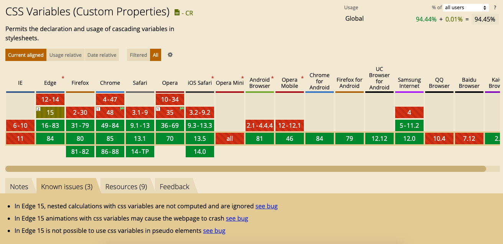

Değişkenler programlama dillerinin neredeyse hepsinde kullanılan bir özelliktir. Frontend dünyasında ise, değişkenler en çok talep edilen CSS özelliklerinden birisiydi. Bu özelliği önceden sadece CSS Önişlemcileri (pre-processor) ile birlikte kullanabiliyorduk. Büyük projelerde, derlenme sürelerinin uzun sürmesi gibi durumlar Önişlemci kullanmanın dezavantajlarını ortaya çıkardı. CSS’in bugün geldiği noktaya bakarsak, herhangi bir Önişlemciye ihtiyaç duymadan bu özelliği kullanmamızı sağlıyor.

Bir proje üzerinde çalışırken birçok öge için aynı değerleri (metin renkleri, arka plan renkleri vb.) kullanmamız gerekir. Bu gibi durumlarda aynı kodu tekrar tekrar yazmak yerine, bir defaya mahsus değişkene bir değer tanımlayıp, bu değişkeni kullanacağımız yerlerde çağırmak, projemiz açısından hem tutarlılık sağlayacak, hemde projenin bakımını kolaylaştıracaktır.

Değişkenler, renkleri, yazı tiplerini ve boşluk değerleri gibi CSS özelliklerini tek bir noktadan yönetmeyi ve bir kod tabanı genelinde tutarlılık sağlamayı kolaylaştırır. Değişkenleri kullanarak bir özelliğe bir değer atayabilir ve bunu CSS kodumuzda ihtiyaç olunan yerlerde yeniden kullanabiliriz.

**Bu bölümde CSS değişkenlerinin şu özelliklerine değinmeye çalışacağım;**


* CSS’te değişkenler nasıl tanımlanır ve bu değişkenler için varsayılan değerler nasıl ayarlanır?
* Tanımladığımız değişkenleri projemizde nasıl kullanabiliriz?
* CSS’te değişkenler nasıl tanımlanır ve bu değişkenler için varsayılan değerler nasıl ayarlanır?
* Değişken değerlerine yedek bir değer ataması nasıl yapılır?
* Değişkenlerde dinamik yapı nedir ve medya sorguları ile nasıl çalışır?
* Değişkenlerin güncel tarayıcı destek durumları


### Değişken Tanımlama


```css
:root {
  --primary-color: #1A73E8;
}

button {
  background-color: var(--primary-color);
}
```


