### Table of contents

- [Grid Layout(Izgara Düzeni) nedir?](#what-is-grid)
- [Izgara Düzeni Terimleri](#grid-terms)
- [Izgara Kapsayıcısı: Izgara yapısını tanımlama](#grid-container)

  - [Izgara tanımlama](#grid-defination)
  - [Satır ve sütun boyutları tanımlama](#line-column-defination)
  - [Fr birimi ile satır ve sütun boyutlarını tanımlama](#fr-defination)
    - [Tekrar eden satırlar ve sütunlar](#repeat)
    - [Minmax() fonksiyonu](#minmax)
  - [Izgara öğelerini aralama](#grid-gap)
  - [Explicit(Belirli) Grid ve Implicit(Belirsiz) Grid](#grid-explicit-implicit)

- [Izgara Öğeleri: Öğeleri ızgaraya yerleştirme](#grid-items)
  - [Adlandırılmış ızgara çizgilerini kullanma](#grid-lines)
  - [Adlandırılmış ızgara alanlarını kullanma](#grid-line-named)
- [Izgara Hizalama: Izgarayı ve Izgara Öğelerini Hizalama](#grid-alignment)
  - [Satır ve sütun ekseni](#row-column-axis)
  - [Izgara hizalama özellikleri](#align-feature)
  - [Izgara öğelerini sıralama](#grid-order)
- [Izgara Denetçi Aracı](#grid-inspector)
- [Tarayıcı Desteği](#grid-support)

Web sayfalarında önceden sayfa düzenleri oluştururken `table`, `float` gibi CSS özellikleri kullanılıyordu. Ancak bu özellikler, sayfa düzenleri oluşturmak için geçici çözümlerdi, çünkü ne `table` ne de `float`, sayfa düzenleri oluşturmak için tasarlanmamıştı. Bu sayfaların daha karmaşık hale gelmesiyle, daha gelişmiş ve kolay sayfa düzenleri oluşturma ihtiyacı doğdu.

Bunun yanı sıra, mobil telefon kullanımının yaygınlaşması, duyarlı sitelerin ortaya çıkmasına sebep oldu. Duyarlı sitelere duyulan ihtiyaç arttıkça, yerleşim düzeninin karmaşıklığı da arttı. Bu karmaşıklık, duyarlı site oluşturmayı kolaylaştırmak için bir dizi özelliğin geliştirilmesine yol açtı.

Daha sonra, öğeleri satırlar veya sütunlar haline yerleştirmek için kullanılan tek boyutlu bir yerleşim aracı olan Flexbox özelliği geldi. Flexbox, öğeleri konumlandırma ile ilgili birçok sorunu çözmek için tasarlanmıştı. Yerleşim düzeni olarak kullanılan önceki yöntemlerde oldukça zor ve maliyetli olan işleri bir hayli kolaylaştırdığı için, bu büyük bir gelişmeydi.

Yerleşim düzeni için sonraki adım, CSS tabanlı bir ızgara sistemi kullanmaktı. Kendi tarayıcıları için daha gelişmiş bir yerleşim düzeni arayan Microsoft çalışanları, ilk olarak Internet Explorer 10'da kullanılmak üzere bir ızgara düzeni üzerinde çalıştılar. Microsoft uygulamasında yayınlandıktan sonra, birkaç web geliştiricisi de bu özelliği denemeye başladı. Bu denemeler sonucunda, W3C'yi üzerinde çalışmaya ve bir özellik olarak yayınlamaya teşvik etti. Bu çalışmaların ardından CSS Grid için tarayıcı desteği, 2017'de Chrome, Firefox, Safari ve Opera'ya desteklenen tüm sürümleri yayınlandı.

## Grid Layout(Izgara Düzeni) nedir? <a name="what-is-grid"></a>

CSS Izgara düzeni, bir web sayfasındaki veya uygulamadaki öğelerin iki boyutlu düzeni için tasarlanmış bir CSS düzen yöntemidir.

Temel amacı, bir HTML elemanını satırlara ve sütunlara bölerek iki boyutlu bir ızgaraya dönüştürmektir. table gibi HTML'de oluşturduğumuz düzenlerin aksine, bu düzeni bize CSS'te oluşturmamızı sağlar. CSS'te oluşturulan düzenin en büyük avantajı, medya sorguları kullanarak yeniden tanımlanabilen ve farklı bağlamlara uyarlanabilen düzenler oluşturmasıdır. Ayrıca kapsadığı öğeleri konumlandırma ve düzenleme için de çok fazla özellik ve esneklik sunar.

## Izgara Düzeni Terimleri <a name="grid-terms"></a>

Izgara düzeni özelliklerinin ve öğelerinin nasıl çalıştığına geçmeden önce ızgara düzenine ait bazı ızgara terimleri vardır. Bu terimler, ızgara düzenimizin nasıl çalıştığını ve çalıştığımız ızgara düzenini anlamamızı kolaylaştırır.

#### Grid Container (Izgara Kapsayıcısı)

Izgara öğelerini sarmalayan kapsayıcıdır. display: grid tanımlanan kapsam, içindeki öğeleri ızgara öğesi düzenine sokar.

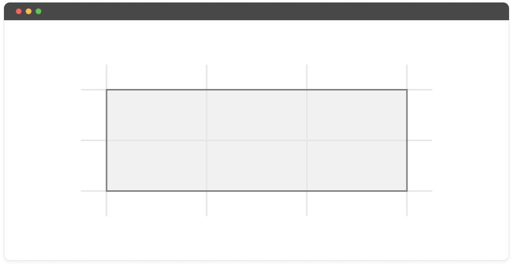

#### Grid Item (Izgara Öğesi)

Izgara kapsayıcısının doğrudan alt öğeleridir.

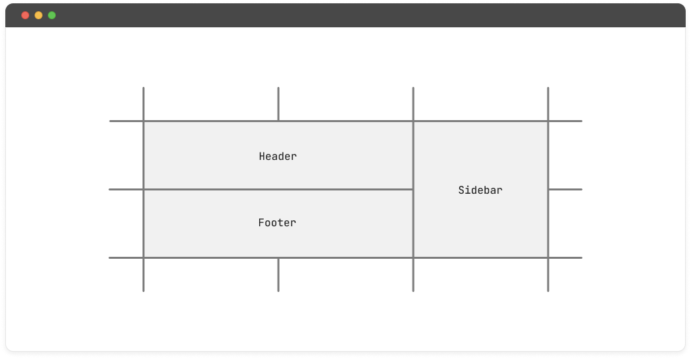

#### Grid Lines (Izgara Çizgileri)

Izgarayı oluşturan yatay ve dikey çizgilerdir. Bir ızgara düzeni oluşturduğumuzda, ızgara bize içindeki öğeleri konumlandırmamızı kolaylaştırmak için numaralı çizgiler verir. Sütun çizgileri soldan sağa, satır çizgileri ise yukarıdan aşağıya 1'den başlayarak numaralandırılır.

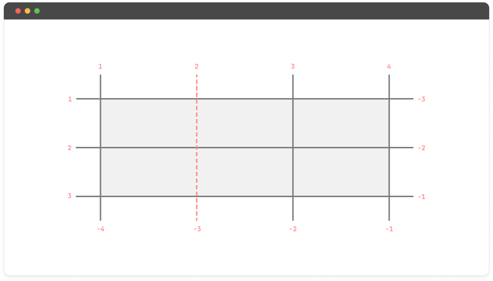

Bir ızgara düzeninde kaç adet satır veya sütun var ise, +1 kadar satır ve sütun çizgisi bulunur. Örneğin dört satır, üç sütunlu bir ızgara düzeninde, beş satır, dört sütun çizgisi vardır.

#### Grid Track (Izgara İzi)

Yatay ve dikey iki ızgara çizgisi arasındaki boşluktur. Aşağıdaki görselde ızgara izi, ikinci ve üçüncü satır çizgileri arasında kalan alandır.

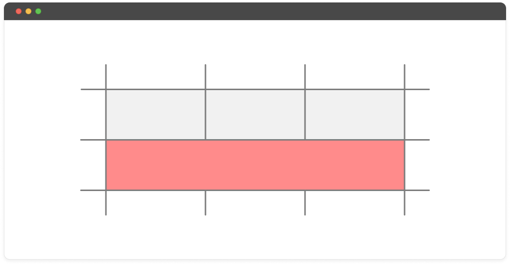

#### Grid Area (Izgara Alanı)

Izgara alanı, ızgara üzerinde dikdörtgen bir alan oluşturan bir veya daha fazla ızgara hücresini kapsayan alandır.

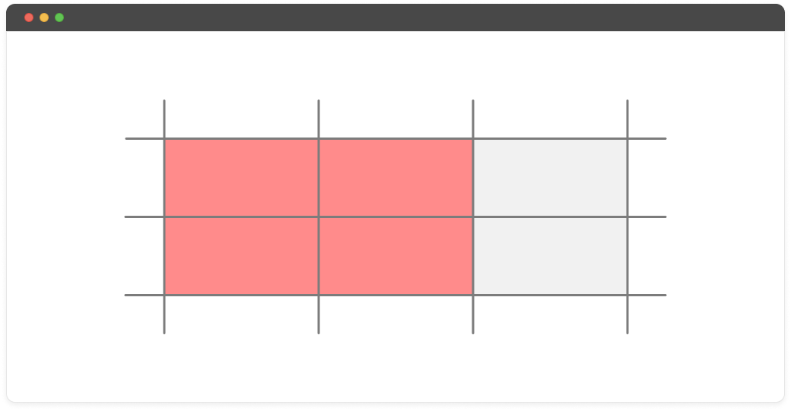

#### Grid Cell (Izgara Hücresi)

Izgara hücresi, dört kesişen ızgara çizgisi arasında kalan boşluktur. Izgara içindeki en küçük birimdir.

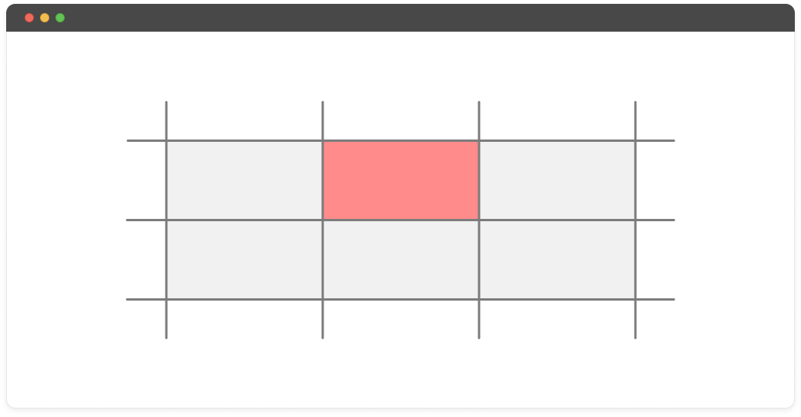

<br>
<br>

Izgara terimlerini öğrendikten sonra, şimdi ızgara düzeni özelliklerine bakalım. Izgara düzeni özellikleri, ızgara kapsayıcısı ve ızgara öğelerine uygulanan özellikler olmak üzere iki gruba ayrılır.

## Izgara Kapsayıcısı: Izgara yapısını tanımlama <a name="grid-container"></a>

Bir ızgaranın kapsayıcısının yapısı, kaç satır ve sütuna sahip olduğu, boyutları gibi ızgara kapsayıcısına uygulanan özellikler tarafından kontrol edilir.

### Izgara tanımlama <a name="grid-defination"></a>

Bir ızgara düzeni oluşturmak için, kapsayıcı elemanımıza display: grid özelliğini tanımlarız. Bu tanım, kapsayıcı elemanı, ızgara kapsayıcısı, kapsayıcı elemanın doğrudan alt öğelerini de, ızgara öğeleri haline getirir.

```html
<div class="grid-container">
  <div class="grid-item">A</div>
  <div class="grid-item">B</div>
  <div class="grid-item">C</div>
  <div class="grid-item">D</div>
  <div class="grid-item">E</div>
  <div class="grid-item">F</div>
</div>
```

```css
.grid-container {
  display: grid;
}
```

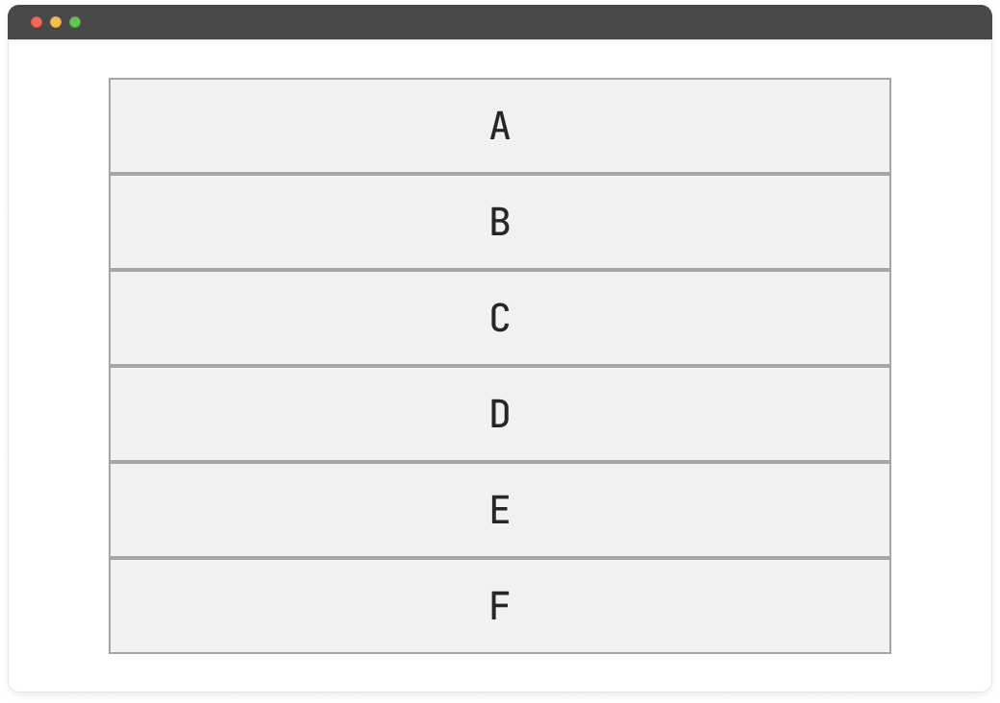

Kapsayıcı elemanımıza ızgara tanımlaması yaptıktan sonra, arayüz görünümünde herhangi bir değişiklik olmaz, çünkü tek başına display: grid tanımı, ızgarayı satırlara ve sütunlara bölmez. Kapsayıcı elemanımıza, ızgara düzenimizin kaç satır ve sütundan oluşacağını belirtmemiz gerekir.

### Satır ve sütun boyutları tanımlama <a name="line-column-defination"></a>

`grid-template-rows` ve `grid-template-columns` özellikleri, ızgara düzeni için satır ve sütun tanımlaması yapmamızı sağlar. Satır ve sütun tanımlamanın birkaç farklı yöntemi vardır. Burada önemli olan noktalardan bir tanesi, ızgara yapısını oluşturmadan önce ne yapmak istediğimizi bilmektir. Bu, oluşturacağımız ızgara yapısının yaklaşımını ve kullanacağımız yöntemi belirler.

```css
.grid-container {
  display: grid;
  grid-template-columns: 200px 200px 200px;
  grid-template-rows: 100px 100px;
}
```


Yukarıda, `200px` genişliğinde üç sütunlu ve `100px` yüksekliğinde iki satırlı bir ızgara düzeni tanımlamış olduk.

#### grid-template özelliği

Yukarıdaki ızgara düzeninde sütun ve satır sayılarını tanımlamak için iki ayrı özellik kullandık. `grid-template` özelliği, bu iki özelliği tek bir satırda yazmamızı sağlıyor.

```css
/* grid-template: [satır değerleri] / [sütun değerleri] */

.grid-container {
  display: grid;
  grid-template: 100px 100px / 200px 200px 200px;
}
```

Bu kullanım, ızgara düzenlerinde kodu daha sade hale getirmekle birlikte kodu okumayı da zorlaştırır.

### Fr birimi ile satır ve sütun boyutlarını tanımlama <a name="fr-defination"></a>

Izgara izleri herhangi bir uzunluk birimi kullanılarak tanımlanabilir. Bu birimlerin yanında ızgara düzeni, fraction(kesir) kelimesinin kısaltması olan `fr` adında yeni bir ölçü birimi ile gelir. Kısaca tanımı, `fr` ızgara kapsayıcısındaki kullanılabilir alanın bir bölümünü temsil eden bir birimdir.

Daha fazla okuma için: https://hackernoon.com/understanding-css-grids-fractional-units-fr-the-easy-way-5f43ee008f29

Bu özelliği bir örnekle açıklamak daha doğru olacaktır.

Her öğenin `%25` genişliğe sahip olduğu dört sütunlu bir ızgara yapısı tanımlayalım.

```css
.grid-container {
  display: grid;
  grid-template: 100px 100px / 200px 200px 200px;
}
```


Izgara izlerinin her biri, ızgara kapsayıcısının %25'lik bir alanını kaplıyor. Daha sonra `grid-gap` (bu özelliğe daha sonra bakacağız) özelliğini kullanarak ızgara kapsayıcısı içindeki satırlara boşluk verelim.

```css
.grid-container {
  display: grid;
  grid-template-columns: 25% 25% 25% 25%;
  grid-gap: 32px;
}
```

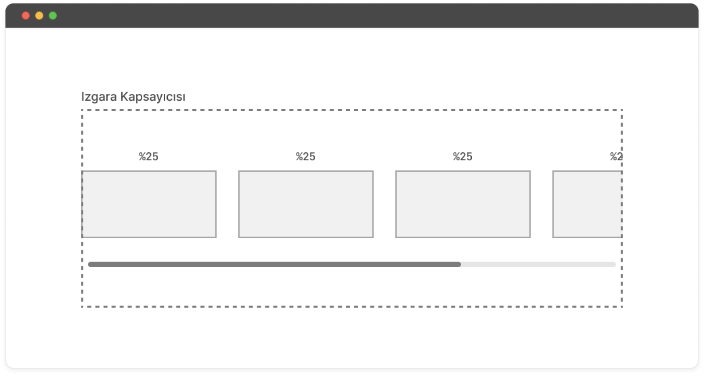

Izgara kapsayıcısı hala aynı genişliğe sahipken, satır ve sütun boşluklarının yerleşim alanlarına dahil edilmesinden dolayı, ızgara öğeleri kapsayıcının dışına taştı.

Burada `fr` birimi, bu boşlukları yerleşim alanından hariç tutarak kullanılabilir alanın hesabını otomatik olarak yapıp, ızgara öğelerinin yerleşimini sağlar.

```css
.grid-container {
  display: grid;
  grid-template-columns: 1fr 1fr 1fr 1fr;
  grid-gap: 32px;
}
```

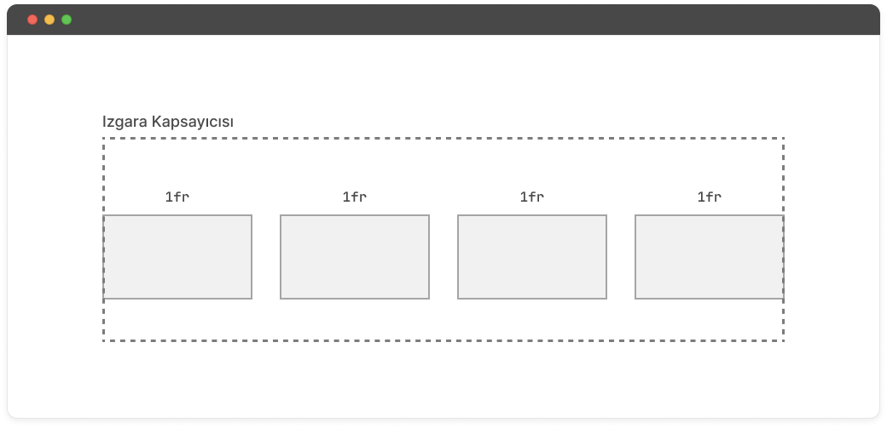

#### Tekrar eden satırlar ve sütunlar <a name="repeat"></a>

Bazı ızgara düzenleri, satır veya sütun değerlerini tanımlarken yukarıdaki örnekte olduğu gibi kendini tekrar eden değerler içerebilir. Bu değerleri tek tek tanımlamak yerine, ızgara düzeni ile gelen başka bir özellik olan `repeat()` fonksiyonunu kullanabiliriz. `repeat()` fonksiyonunun amacı, tekrar eden değerleri daha kısa yazmamızı sağlar.

Repeat fonksiyonu iki değer alır:

- İlk değer, ızgara izlerinin tekrarlanma sayısı,
- İkinci değer ise tekrarlanacak ızgara izlerinin boyutunu belirtir.

```css
.grid-container {
  display: grid;
  grid-template-columns: repeat(4, 1fr);
}
```

#### Minmax() fonksiyonu <a name="minmax"></a>

`minmax()` fonksiyonu, ızgara izleri için belirli bir boyut aralığı değeri tanımlamamızı sağlar. İlk değer minimum, ikinci değer ise maksimum değeri belirtir.

```css
.grid-container {
  display: grid;
  grid-template-columns: minmax(200px, 500px) 1fr;
}
```

İki sütunlu bir ızgara yapımızda, ilk sütunun değeri en az `200px`, en fazla `500px` genişliğe sahip olucak şekilde tanımlama yaptık. Bu tanımlama ile, ilk sütun `200px` ile `500px` arasında bir genişliğe sahip olup, ikinci sütun ise kalan boş alanı dolduracaktır.

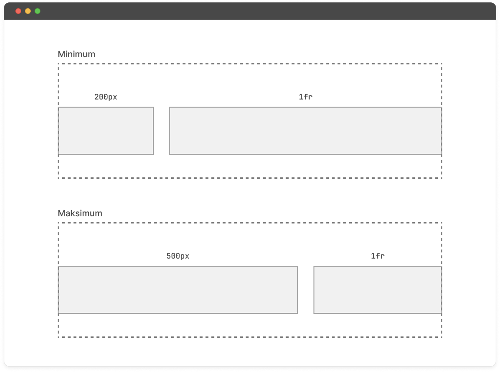

##### Kullanma kuralları:

`minmax()` fonksiyonunu kullanırken bazı dikkat etmemiz gereken kurallar vardır.

- Minimum değer, maksimum değerden büyükse, maksimum değer okunmaz, sadece minimum değer uygulanır.
- Minimum değer için `fr` birimi kullanılmaz. Yalnızca maksimum değer için kullanılabilir.

##### Repeat() fonksiyonu birlikte kullanma

Bir ızgara düzeninde tekrar eden değerler için de minimum ve maksimum değer aralıkları belirtebiliyoruz. Bunu `repeat` fonksiyonun içinde `minmax` kullanarak yapıyoruz.

```css
.grid-container {
  display: grid;
  grid-template-columns: repeat(4, minmax(200px, 1fr));
}
```

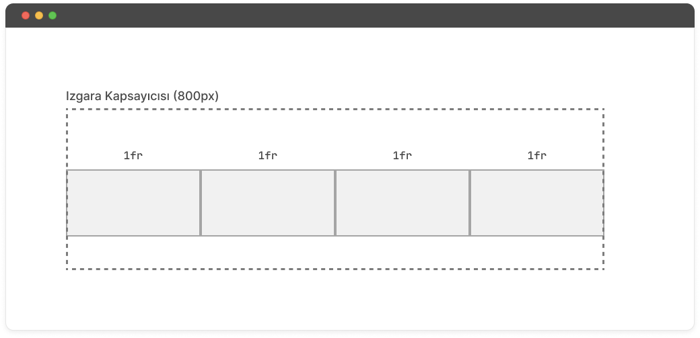

Yukarıdaki örnekte `repeat` ile kullandığımız `minmax` fonksiyonuna ait ızgara düzeni, her ne kadar çalışsa da aslında doğru bir yöntem değildir. Çünkü bir ızgara düzeninde `repeat` fonksiyonu ile satır veya sütun tanımlaması yaparken her zaman sabit bir değer belirtiriz. Bu değerin yanında ızgara izlerimize bir de `minmax` ile değer ataması yaptığımızda, ızgara kapsayıcısının genişliği, ızgara hücrelerinin minimum genişliğinden dar olduğu durumlarda, ızgara izleri, kapsayıcının dışına taşar ve yeni satırlara kaydırılmaz. Bunun sebebi `repeat` fonksiyonuna atanan sabit değer yüzündendir.


Bu durumu engellemek için, ızgara düzeni ile gelen başka bir özellik olan `auto-fit` veya `auto-fill` değerlerini kullanarak, ekstra medya sorgularına ihtiyaç duymadan duyarlı bir ızgara düzeni oluşturabiliriz.

##### auto-fit ve auto-fill değerleri

`auto-fit` ve `auto-fill` değerleri, ızgara izlerinin kapsayıcının dışına taşmadan kullanılabilir alana sığacak kadar sütun veya satır oluşturmamızı sağlar. Izgara kapsayıcısına sığmadığı durumlarda ise, ızgara izlerinin, otomatik olarak bir sonraki satıra veya sütuna kaydırılmasını sağlarlar.

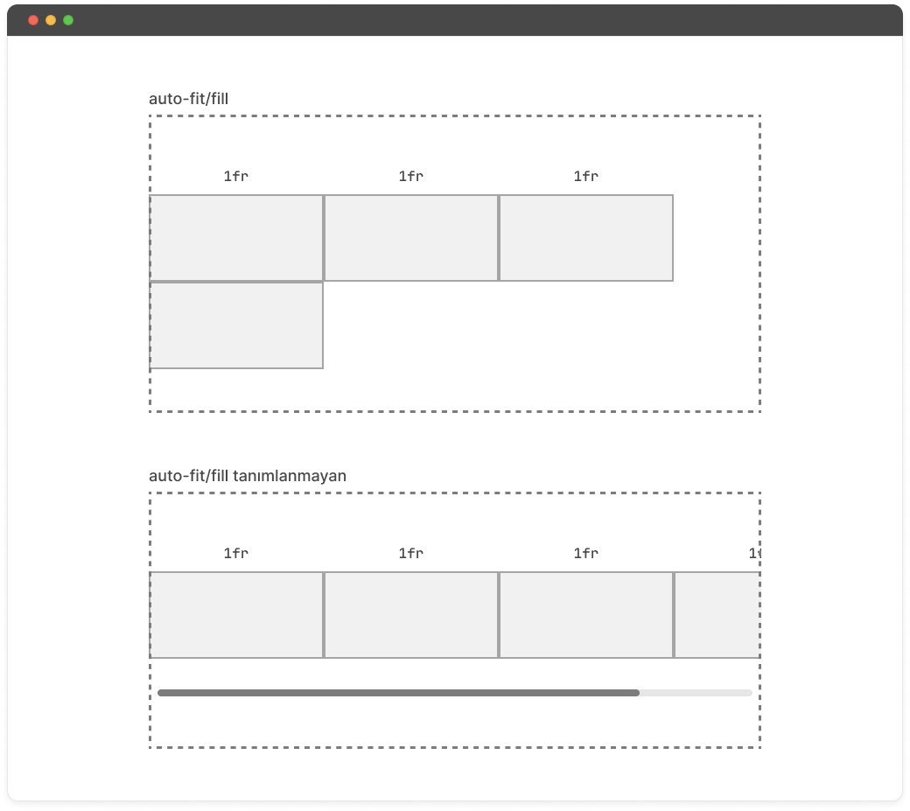

Bu iki değer, ilk bakışta birbirinin zıt değerleri gibi görünebilir fakat aralarında çok ince bir fark vardır. Bu ince fark, ızgara kapsayıcısının genişliği, ızgara izlerinin toplam genişliğinden fazla olduğu durumlarda ortaya çıkar.

`auto-fit` değeri, ızgara izlerinin toplam genişliği, ızgara kapsayıcısının genişliğini aşmadığı durumlarda kalan boş alanı, ızgara izlerini dolduracak şekilde genişletir. `auto-fill` değeri, ızgara izlerinin genişliğini değiştirmeden kalan boş alanı korur.

Aralarındaki farkı daha iyi anlamak için aşağıdaki örneğe bakalım.

```css
.grid-container--fit {
  display: grid;
  grid-template-columns: repeat(auto-fit, minmax(200px, 1fr));
}

.grid-container--fill {
  display: grid;
  grid-template-columns: repeat(auto-fill, minmax(200px, 1fr));
}
```

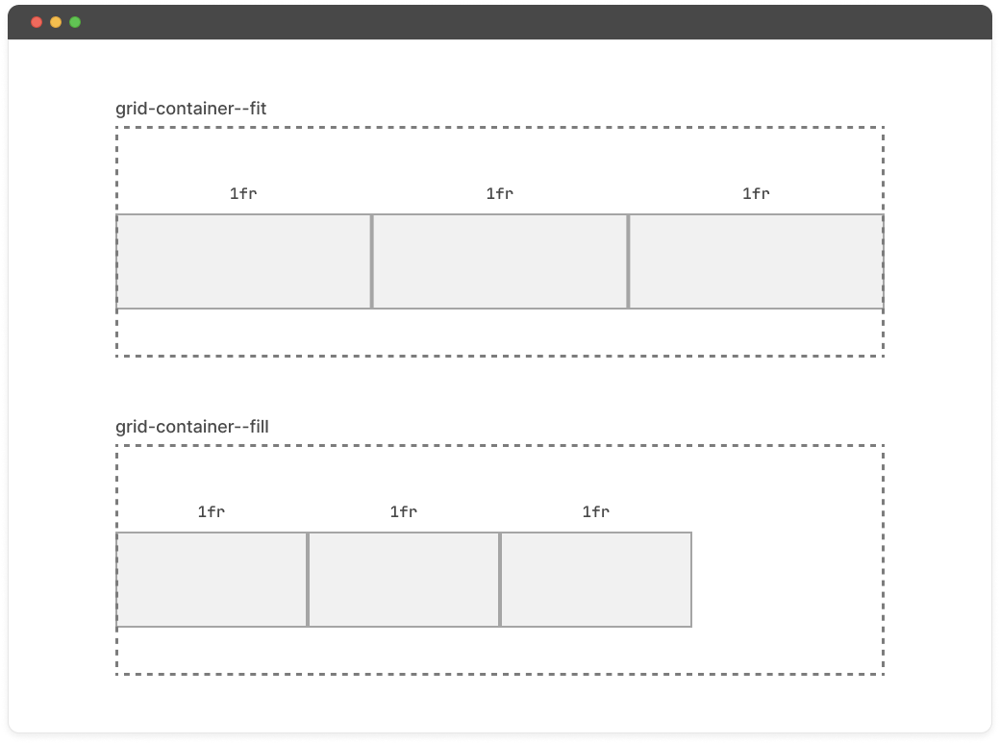

Belirli bir görüntü alanı genişliğine kadar, her iki değer de aynı sonucu verir. Görüntü alanı genişliği değiştiği durumda fark ortaya çıkar.

<figure >
  <video controls="true" allowfullscreen="true">
    <source src="https://user-images.githubusercontent.com/47773417/154422024-d21613ae-708b-4dab-884f-93fe5c3e92ec.mp4" type="video/mp4">
  </video>
</figure>

### Izgara öğelerini aralama <a name="grid-gap"></a>

`column-gap` ve `row-gap` özellikleri bir ızgara düzeninde, satırlar veya sütunlar arasındaki boşluğu ayarlamak için kullanılır.

```css
.grid-container {
  display: grid;
  grid-template-columns: repeat(4, 1fr);
  grid-template-rows: repeat(2, 100px);
  column-gap: 32px;
  row-gap: 32px;
}
```

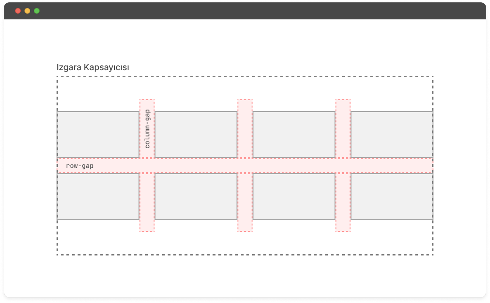

Satır ve sütun boşluklarını ayrı ayrı tanımlayabildiğimiz gibi, iki değeri `gap` özelliği sayesinde tek bir satır içinde de tanımlayabiliyoruz. Ayrıca `gap` özelliğine tek bir değerin atanması, satır ve sütun boşlukları için aynı değerin tanımlanmasını sağlar.

```css
/* gap: [satır boşluğu] / [sütun boşluğu] */

.grid-container {
  display: grid;
  grid-template-columns: repeat(4, 1fr);
  grid-template-rows: repeat(2, 100px);
  gap: 32px;
}
```

### Explicit(Belirli) Izgara ve Implicit(Belirsiz) Izgara <a name="grid-explicit-implicit"></a>

Genelde bir ızgara düzeni içerisinde ızgara öğelerini boyutlandırmak ve konumlandırmak için `grid-template-columns` ve `grid-template-rows` özelliklerini kullanarak sabit sayıda bir ızgara düzeni oluştururuz. Bu sabit sayıda oluşturulan ızgara düzeninin içindeki öğelerin sayısı belli olduğu için, bu düzene “explicit(belirli)” ızgara diyoruz.

Ancak ızgara öğelerinin dinamik olarak geldiği bazı durumlarda, explicit(belirli) ızgara öğeleri dışında kalan ızgara öğelerimiz olabilir.

Örneğin `200px` genişliğinde üç sütunlu, `100px` yüksekliğinde iki satırlı bir ızgara düzeni oluşturmak istediğimizde, bu ızgara düzenine altı ızgara öğesi sığabilecek şekilde tanımlama yapmış oluruz.

```html
<div class="grid-container">
  <div class="grid-item">A</div>
  <div class="grid-item">B</div>
  <div class="grid-item">C</div>
  <div class="grid-item">D</div>
  <div class="grid-item">E</div>
  <div class="grid-item">F</div>
</div>
```

```css
.grid-container {
  display: grid;
  grid-template-columns: repeat(3, 200px);
  grid-template-rows: repeat(2, 100px);
  gap: 32px;
}
```

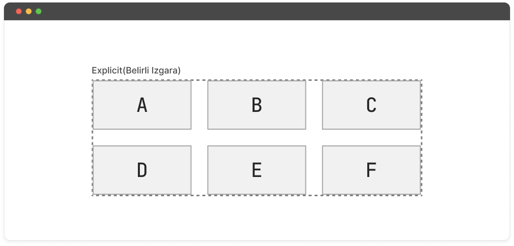

Bu ızgara düzenimize sonradan üç ızgara öğesi daha eklersek, artık sabit sayıda belirlediğimiz ızgara düzenimizin dışında üç ızgara öğesi olmuş olur. İşte bu dışarıda kalan ızgara öğelerinin bulunduğu yapıya implicit(belirsiz) ızgara denir.

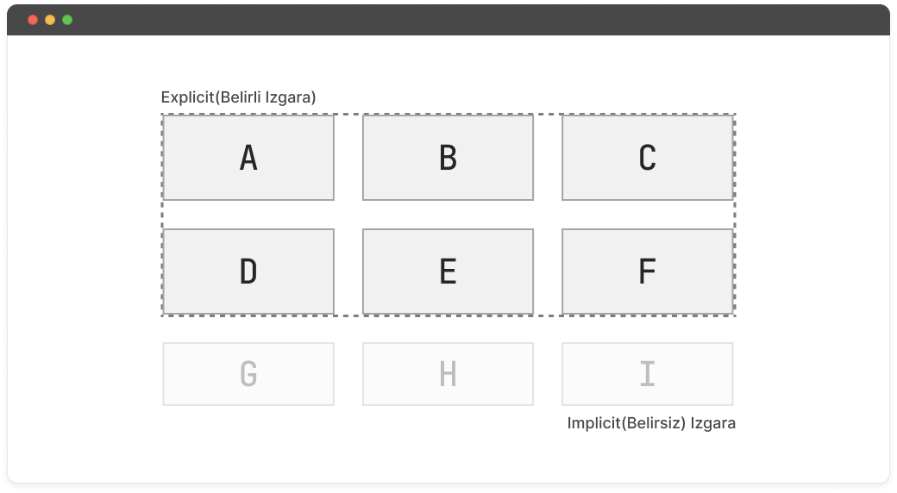

Explicit(belirli) ızgara öğelerimizin dışında kalan, öğeler olduğu durumda, implicit(belirsiz) ızgara, kapsayıcı tarafından otomatik olarak oluşturulur ve bu öğeler varsayılan olarak otomatik boyutlandırılır. Bu öğeler ızgara düzeni içerisinde, içeriklerine genişler veya kapsayıcıdaki kalan alana göre boşluğu doldurur.

Örneğin `600px` yüksekliğe sahip bir ızgara kapsayıcımızda, implicit(belirsiz) ızgara öğelerimizin yüksekliği `400px` olur.

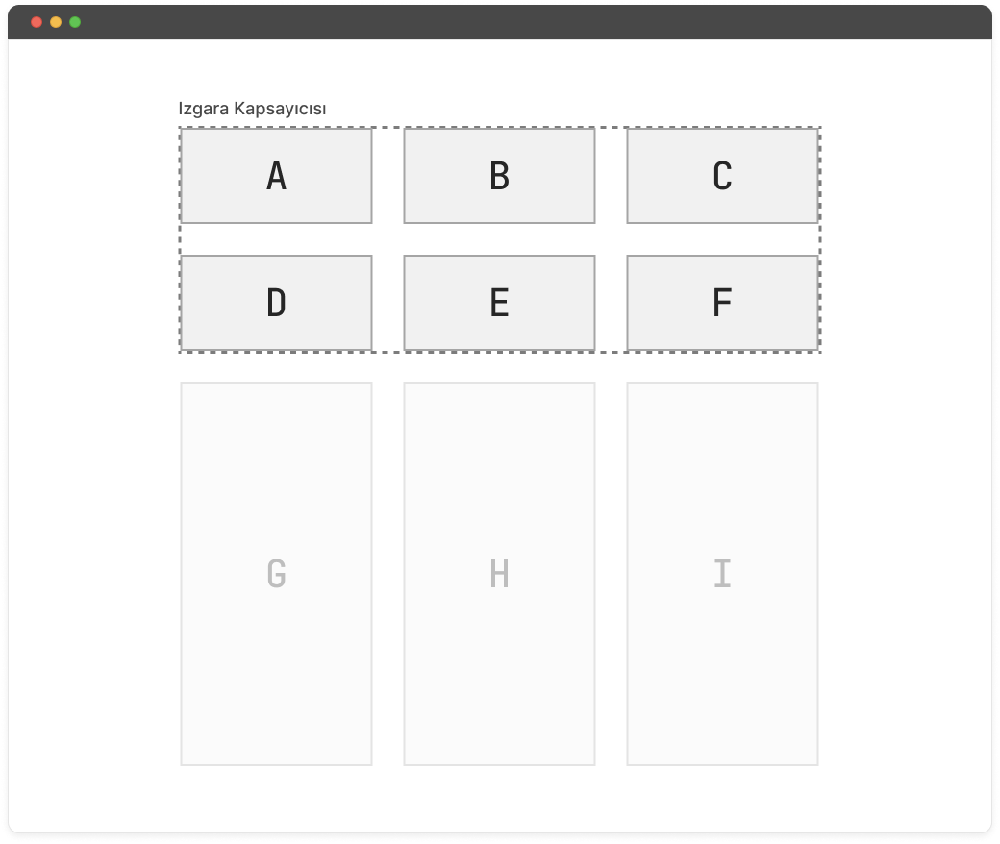

#### Implicit Izgara öğeleri için boyut belirleme

Sonradan eklenen implicit(belirsiz) ızgara öğelerimizin, diğer öğeler ile aynı yükseklikte olmadığını gördük. Peki bu ızgara öğelerimizi, diğer öğelerimiz ile nasıl aynı yüksekliğe getirebiliriz? İşte burada `grid-auto-rows` ve `grid-auto-columns` özellikleri devreye giriyor. Bu özellikler explicit(belirli) ızgara öğelerimizin dışında kalan öğeler için satır ve sütun boyutlarının belirlememizi sağlar.

```css
.grid-container {
  display: grid;
  grid-template-columns: repeat(3, 200px);
  grid-template-rows: repeat(2, 100px);
  grid-auto-rows: 100px;
  gap: 32px;
}
```

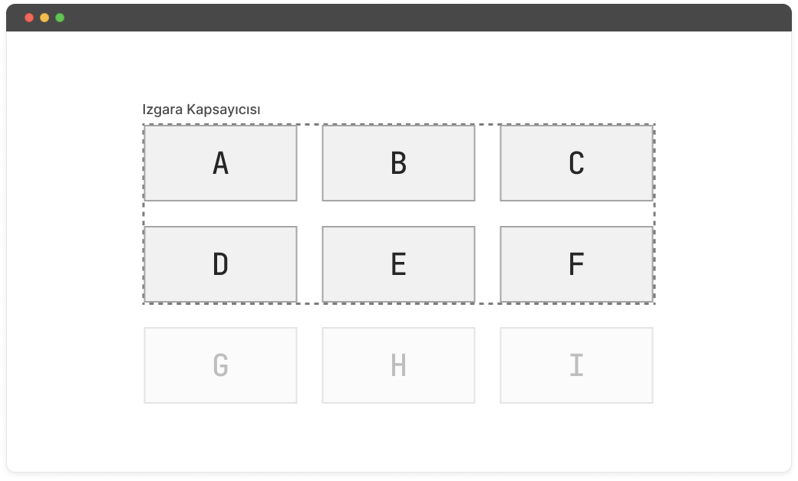

#### grid-auto-flow

Yukarıdaki örnekte implicit(belirsiz) ızgara öğelerimiz için satır yüksekliği tanımlaması yaptık. Peki satırlar yerine sütun tanımlaması yapmak isteseydik? İşte burada da grid-auto-flow özelliğini kullanabiliriz. Bu özellik otomatik yerleştirilen ızgara öğeleri için satırların mı yoksa sütunların mı kullanılacağını belirlememizi sağlar. Üç farklı değer alır, `row`, `column`, `dense`. Başlangıç değeri `row`’dur. Bu, yukarıdaki örnekte neden sütunların değilde satırların oluşturulduğunu açıklar.

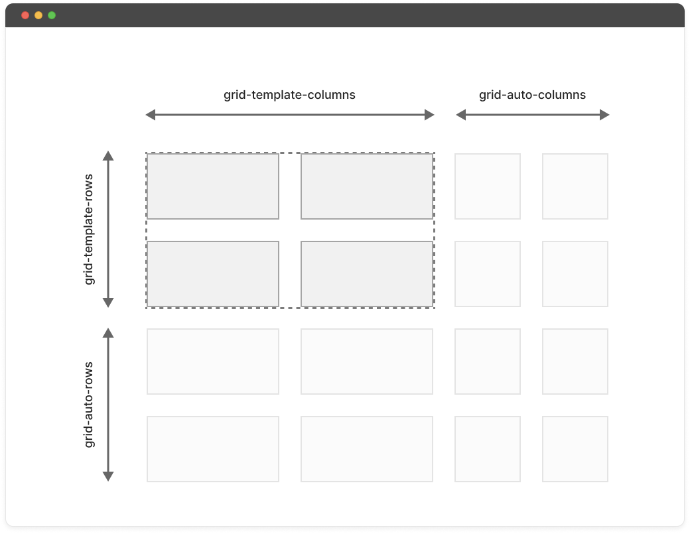

Sütunları kullanmak istersek:

```css
.grid-container {
  display: grid;
  grid-template-columns: repeat(3, 200px);
  grid-template-rows: repeat(2, 100px);
  grid-auto-flow: column;
  grid-auto-columns: 200px;
  gap: 32px;
}
```

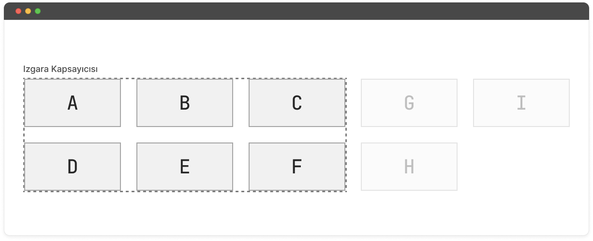

Bu tanım, implicit(belirsiz) ızgara öğelerimizin satırlar yerine, sütunlara yerleştirilmesini sağlayacaktır.

##### Dense değeri

Dense değeri, ızgara öğelerini, ızgara düzeni içerisinde daha kompakt tutmanıza ve tutarsız boyuttaki ızgara öğeleri nedeniyle oluşabilecek çok sayıda boşluğa, uygun olan ızgara öğelerinin doldurulmasını sağlar.

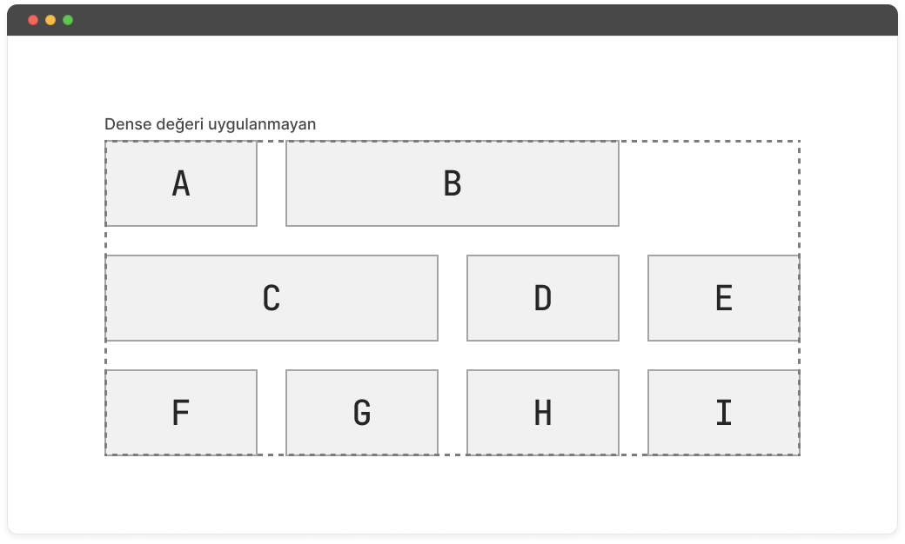

Dense değeri uygulanan:

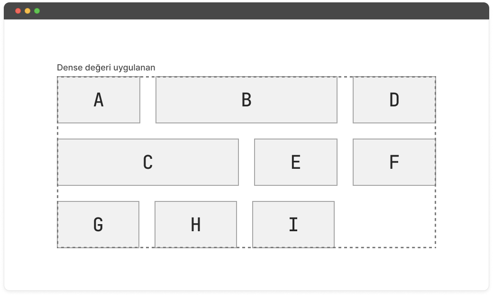

Bu değerin kullanılması, öğelerin sıralamasının bozuk görünmesine neden olabilir, çünkü fazladan kalan ızgara boşluklarına, uygun olan öğe doldurulduğunda sıralama otomatik olarak değişmiş olur. Bu nedenle bu değer kullanımı her durum için uygun değildir.

## Izgara Öğeleri: Öğeleri ızgaraya yerleştirme <a name="grid-items"></a>

Yukarıdaki örneklerde, ızgarayı oluşturan ızgara kapsayıcısının özelliklerine baktık. Izgara kapsayıcısına uygulanan bu özelliklerin, ızgaranın yapısını tanımlamak için kullanıldığını gördük. Bu bölümde ızgara öğelerinin özelliklerine bakarak, öğeleri ızgara düzeni içinde nasıl konumlandırabileceğimize bakacağız.

Bu özelliklere geçmeden önce, bir ızgara düzeni oluşturduğumuzda ortaya çıkan ızgara çizgilerini anlamamız gerekiyor. Izgara terimlerinde bahsettiğimiz ızgara çizgileri kısaca, ızgara öğelerini konumlandırmamızı kolaylaştırmak için ızgara kapsayıcısı tarafından oluşturulan numaralı çizgilerdir. Bu çizgiler ızgara öğelerimizi konumlandırırken bizlere yardımcı olur.

Izgara öğelerini, ızgara düzenine yerleştirmenin birden çok yöntemi vardır. Şimdi bu yöntemlere sırasıyla bakalım.

İlk olarak, bir ızgara öğesini ızgaraya yerleştirmek için, başladığı ve bitmesini istediğimiz ızgara çizgisini belirterek konumlandırma yapabiliriz. Bu tanımları aşağıdaki ızgara öğe özelliklerini kullanarak yapıyoruz.

- grid-column-start
- grid-column-end
- grid-row-start
- grid-row-end

```html
<div class="grid-container">
  <div class="header">Header</div>
  <div class="sidebar">Sidebar</div>
  <div class="content">Content</div>
  <div class="footer">Footer</div>
</div>
```

```css
.grid-container {
  display: grid;
  grid-template-columns: 1fr 3fr;
  grid-template-rows: repeat(2, 100px);
  gap: 32px;
}

.header {
  grid-row-start: 1;
  grid-row-end: 2;
  grid-column-start: 1;
  grid-column-end: 4;
}

.sidebar {
  grid-row-start: 2;
  grid-row-end: 3;
  grid-column-start: 1;
  grid-column-end: 2;
}

.content {
  grid-row-start: 2;
  grid-row-end: 3;
  grid-column-start: 2;
  grid-column-end: 4;
}

.footer {
  grid-row-start: 3;
  grid-row-end: 4;
  grid-column-start: 1;
  grid-column-end: 4;
}
```

Bu kod bloğu, ızgara düzeni içerisindeki öğeleri satır çizgi numaralarına göre konumlandırır.

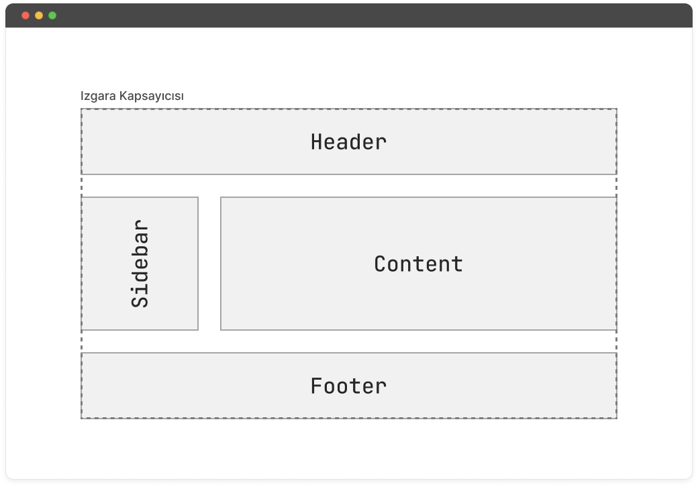

`grid-column` ve `grid-row` özellikleriyle yukarıdaki tanımlamayı daha da kısa hale getirebiliyoruz.

```css
.header {
  grid-row: 1 / 2;
  grid-column: 1 / 4;
}
```

Ayrıca `grid-area` özelliği sayesinde bu dört değeri tek bir satırda yazabiliyoruz.

```css
/* grid-area: grid-row-start / grid-column-start / grid-row-end / grid-column-end */

.header {
  grid-area: 1 / 1 / 2 / 4;
}
```

### Adlandırılmış ızgara çizgilerini kullanma <a name="grid-lines"></a>

Yukarıda, ızgara öğelerini, başlangıç ve bitiş çizgi numaraları belirterek konumlandırmıştık. Bu kullanım daha karmaşık ızgara düzenlerimizde anlaması zor bir duruma gelebilir. Bu sebepten dolayı burada ızgara çizgilerini adlandırmak ve ardından adlandırılmış bu ızgara çizgilerini kullanarak ızgara öğelerini konumlandırmak, ızgara düzeni için daha anlaşılır bir yapı kurmayı sağlar.

Izgara düzeni içerisinde `grid-template-rows` ve `grid-template-columns` özellikleri ile tanımladığımız satar ve sütun çizgilerini isimlendirebiliyoruz. Bu ızgara çizgilerini isimlendirirken, köşeli parantez `[]` içinde belirtiyoruz. Bu isimleri istediğimiz gibi belirleyebiliriz fakat ızgara düzeninin anlaşılabilir ve okunabilir olması için anlamlı isimler vermek faydalı olacaktır.

Yukarıdaki örneği, ızgara çizgilerini isimlendirerek yeniden oluşturalım.

Burada bir çizgiye birden fazla isim tanımlayabiliyoruz. Bu, aslında her çizginin ızgara içindeki konumuna göre iki farklı adnının olması anlamına geliyor. İki farklı ismi tek bir köşeli parantez içinde belirtiyoruz.

```css
.grid-container {
  display: grid;
  grid-template-rows: [header-row-start] 100px [header-row-end sidebar-row-start] 100px [sidebar-row-end footer-row-start] 100px [footer-row-end];
  grid-template-columns: [header-col-start] 1fr [sidebar-col-end content-col-start] 3fr [header-col-end];
  grid-gap: 32px;
}
```

Oluşturduğumuz çizgi isimlerini ızgara öğelerine yerleştirelim.

```css
.header {
  grid-row: header-row-start / header-row-end;
  grid-column: header-col-start / header-col-end;
}

.sidebar {
  grid-row: sidebar-row-start / sidebar-row-end;
  grid-column: header-col-start / sidebar-col-end;
}

.content {
  grid-row: sidebar-row-start / sidebar-row-end;
  grid-column: content-col-start / header-col-end;
}

.footer {
  grid-row: footer-row-start / footer-row-end;
  grid-column: header-col-start / header-col-end;
}
```

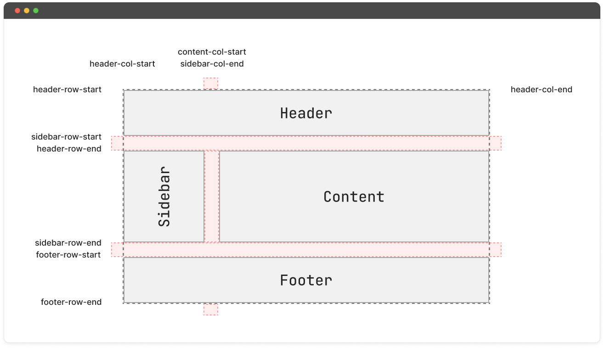

### Adlandırılmış ızgara alanlarını kullanma <a name="grid-line-named"></a>

Izgara öğelerini ızgaraya yerleştirmenin farklı bir yolu ise `grid-template-areas` özelliğini kullanarak, ızgara alanlarını isimlendirmektir.

Izgara öğelerimize `grid-area` özelliği ile özel alan isimleri oluşturduktan sonra, bu özel alan isimlerini, `grid-template-areas` özelliği ile ızgara kapsayıcımızda belirtiyoruz.

```html
<div class="grid-container">
  <div class="header">Header</div>
  <div class="sidebar">Sidebar</div>
  <div class="content">Content</div>
  <div class="footer">Footer</div>
</div>
```

Burada öğelerin yerleşimi CSS ile yapılacağı için yukarıdaki HTML elementlerinin sıralamasının önemi yoktur.

Izgara öğelerimize özel alan isimleri tanımlayalım.

```css
.header {
  grid-area: header;
}

.sidebar {
  grid-area: sidebar;
}

.content {
  grid-area: content;
}

.footer {
  grid-area: footer;
}
```

Ardından ızgara kapsayıcısında, adlandırılmış alanları yerleştirelim.

```css
.grid-container {
  display: grid;
  grid-template-columns: 1fr 3fr;
  grid-template-rows: repeat(2, 100px);
  gap: 32px;
  grid-template-areas:
    "header header header"
    "sidebar content content"
    "footer footer footer";
}
```


Yukarıda ki yerleşimde, tırnak içindeki her bölüm bir satırı ve her kelime ise bir sütunu temsil eder. Buradaki en önemli nokta, her satırın eşit sayıda alana sahip olması gerekir.

Aşağıdaki kullanım yanlıştır ve atadığımız değerler geçersiz kabul edilir.

```css
.grid-container {
  grid-template-areas:
    "header header"
    "sidebar content content"
    "footer footer footer";
}
```

İlk örneğimizde eşit sayıda bir ızgara alanı oluşturduk. Bazı durumlarda eşit olmayan alanlar için boş alanlar tanımlamamız gerekir. Bu boş alanı tanımlamak için `grid-template-areas` özelliği içinde boşluk gelen alana nokta (.) koyarak, belirli bir hücreye ızgara alanı atamak istemediğimizi belirletebiliyoruz. Ayrıca tek nokta yerine bitişik nokta dizisi(......)'de tanımlayabilmek, görsel anlamda isim genişliklerinin dikey eksende aynı hizada olmasını sağlıyor.

```css
.grid-container {
  grid-template-areas:
    "header header"
    "sidebar content content"
    ". footer footer";
}

/* ya da */

.grid-container {
  grid-template-areas:
    "header header"
    "sidebar content content"
    "...... footer footer";
}
```

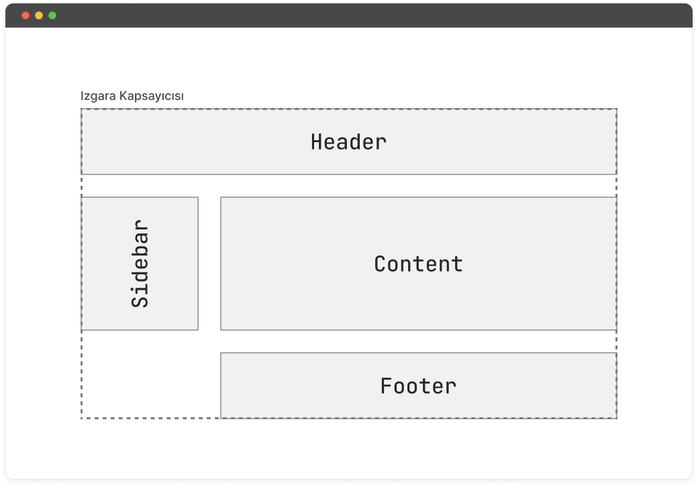

##### Kullanma kuralları:

`grid-template-areas` özelliğini kullanırken bazı dikkat etmemiz gereken kurallar vardır. Bunlardan bir tanesi yukarıda bahsettiğimiz her satırın eşit sayıda alan içermesiydi. Şimdi diğer bazı kurallara bakalım.

- Tek bir ızgara alanı noktayla ayrılmaz.

```css
.grid-container {
  grid-template-areas:
    "header header"
    "sidebar content content"
    "footer . footer";
}
```

<br>

- Bir alan yalnızca ya yatay ya da dikey alanda yerleşebilir.

```css
.grid-container {
  grid-template-areas:
    "side side side"
    "side content content"
    "side footer footer";
}
```

## Izgara Hizalama: Izgarayı ve Izgara Öğelerini Hizalama <a name="grid-alignment"></a>

### Satır ve sütun ekseni <a name="row-column-axis"></a>

CSS Izgara düzeni, içeriğin satırlar ve sütunlar halinde yerleştirilmesini sağlayan iki boyutlu bir düzen yöntemidir. Bu düzen yönteminde satır ve sütun olmak üzere iki eksenimiz vardır. Satır ekseninin akış yönü, yukarıdan aşağıya, sütun ekseninin ise soldan sağadır.

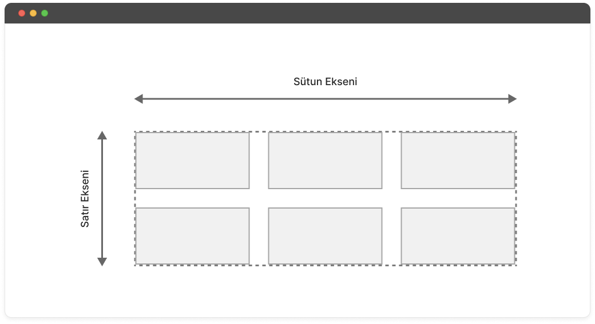

### Izgara hizalama özellikleri <a name="align-feature"></a>

Izgara düzeninde kullanılan hizalama özelliklerinin çoğu, CSS’in kutu hizalama modülünün bir parçasıdır. Bu özellikler diğer CSS bağlamlarında da kullanılır.

#### justify-items:

Izgara öğelerini satır ekseni boyuncu hizalar.

```css
.grid-container {
  justify-items: start | end | center | stretch;
}
```

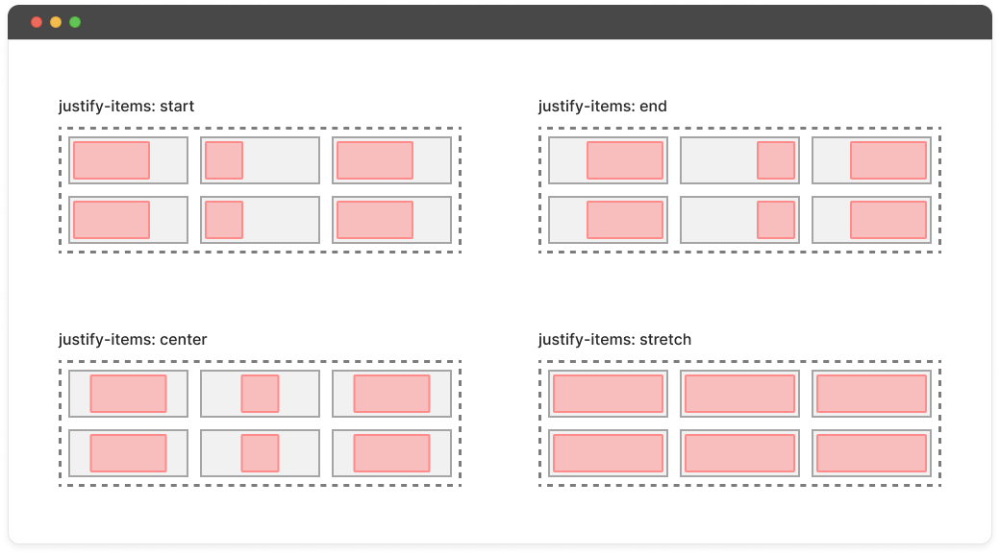

#### align-items:

Izgara öğelerini sütun ekseni boyunca hizalar.

```css
.grid-container {
  align-items: start | end | center | stretch;
}
```

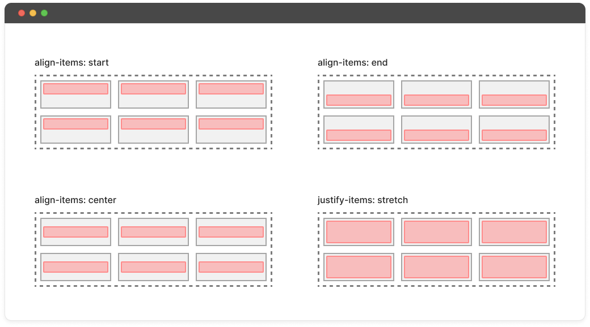

#### place-items:

`place-items`, `justify-items` ve `align-items` özelliklerini tek bir satırda tanımlamamızı sağlar.

```css
/* place-items: [align-items] / [justify-items] */

.grid-container {
  place-items: center / start;
}
```

Eğer ikinci değer belirtilmezse, iki özellik için de tek değer belirtilmiş olur.

```css
/* 
justify-items: center
align-items: center
*/

.grid-container {
  place-items: center;
}
```

#### justify-content:

Bazı durumlarda ızgara öğelerinin toplam boyutu, ızgara kapsayıcısının boyutundan daha küçük olabilir. `justify-content` özelliği tam da bu gibi durumlarda çalışır. Izgara kapsayıcısının içindeki öğeleri tek bir öğe gibi görüp, bu öğelerin hizalanmasını sağlar.

```css
.grid-container {
  justify-content: start | end | center | stretch | space-around | space-between
    | space-evenly;
}
```

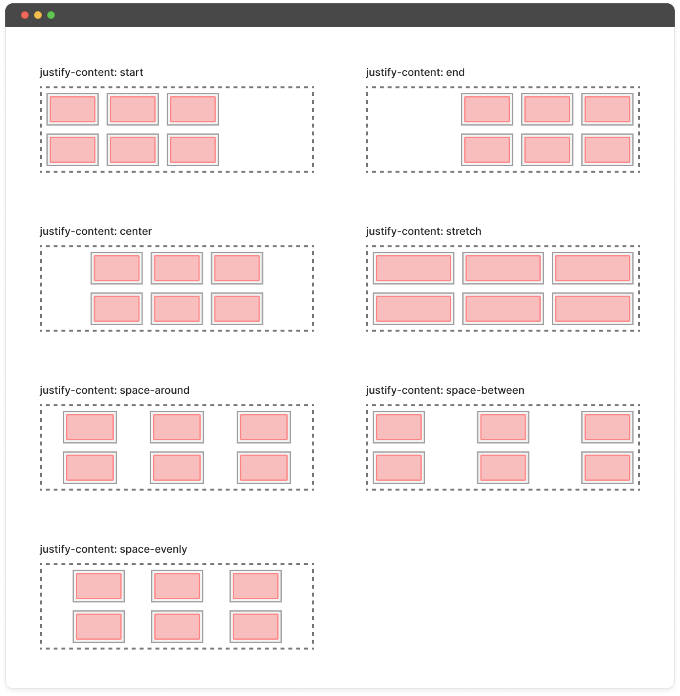

#### align-content:

`align-content` özelliği, ızgara öğelerinin toplam yüksekliği, ızgara kapsayıcısının yüksekliğinden küçük olduğu durumlarda satır bazında çalışır.

```css
.grid-container {
  align-content: start | end | center | stretch | space-around | space-between |
    space-evenly;
}
```

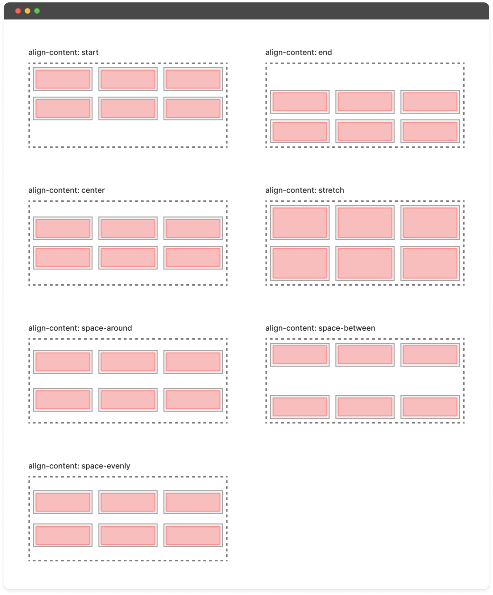

#### place-content:

`place-content`, `align-content` ve `justify-content` özelliklerinin tek bir satırda tanımlanmasını sağlar. `place-items` özelliği için geçerli olan durumlar `place-content` için de geçerlidir.

<br>

Yukarıdaki özelliklerin hepsi ızgara kapsayıcısına uygulanan hizalama özellikleriydi. Bazı hizalama özellikleri ise ızgara öğelerine uygulanır. Bunlar:

- align-self
- justify-self
- place-self

#### justify-self:

Izgara içindeki tanımlanmış ızgara öğesini satır ekseni boyunca hizalar. justify-items özelliğinden tek farkı sadece tek bir öğeye uygunlanmasıdır.

```css
.grid-container {
  justify-self: start | end | center | stretch;
}
```

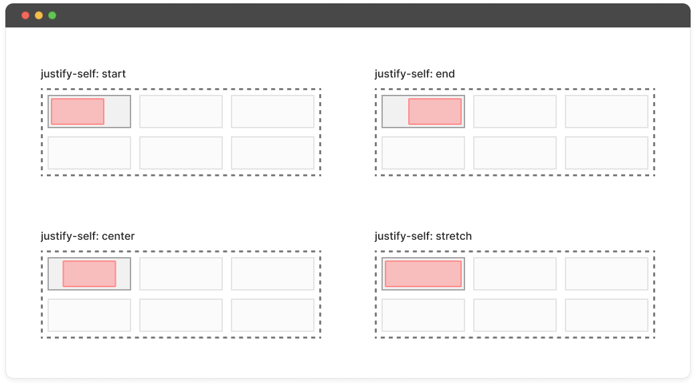

#### align-self:

Izgara içindeki tanımlanmış ızgara öğesini sütun ekseni boyunca hizalar.

```css
.grid-container {
  align-self: start | end | center | stretch;
}
```

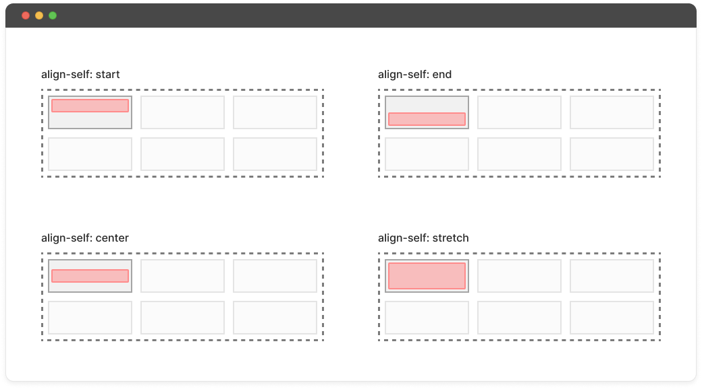

#### place-self:

`place-items` ve `place-content` ile aynı mantıkta çalışır. `justify-self` ve `align-self` özelliklerini tek bir satırda tanımlamamızı sağlar.

```css
/* place-self: [align-self] / [justify-self] */

.grid-item {
  place-self: center / start;
}
```

### Izgara öğelerini sıralama <a name="grid-order"></a>

Bir ızgara düzeninde, tanımlanan `order` değeri, ızgara öğelerinin yerleşim sırasını belirlememizi sağlar.

```html
<div class="grid-container">
  <div class="grid-item a">A</div>
  <div class="grid-item b">B</div>
  <div class="grid-item c">C</div>
  <div class="grid-item d">D</div>
</div>
```

```css
  display: grid;
  grid-template-columns: repeat(4, 200px);
  grid-template-rows: repeat(1, 100px);
  gap: 32px;
}

.c {
	order: -1;
}
```

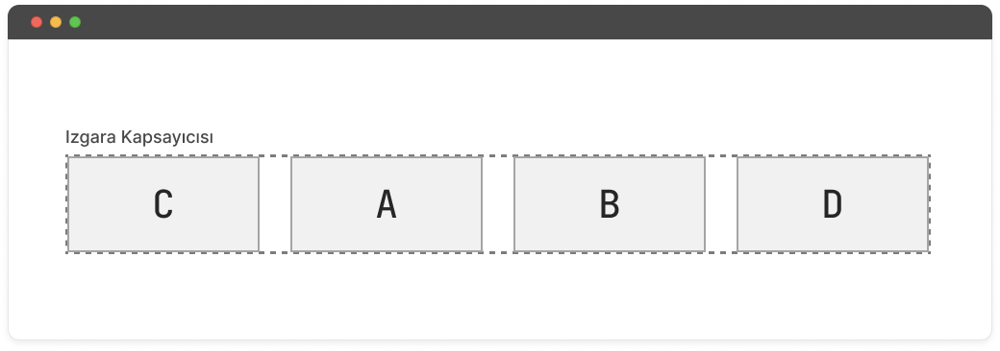

## Izgara Denetçi Aracı <a name="grid-inspector"></a>

Izgara denetleme aracı, tarayıcı üzerinden, oluşturduğumuz ızgara düzenimizin kodunu görselleştirmeye, incelemeye ve düzenlemeye yarayan bir araçtır. Karmaşık ızgara düzenlerimizde, ızgarayı görsel anlamda yorumlamak için oldukça faydalıdır.

Bu araç, önceden sadece Firefox tarayıcısına özeldi. Daha sonra diğer tarayıcılara da, Firefox aracı kadar kapsamlı olmasa da, bu özellik geldi. Diğer tarayıcılardaki özelliklerin yeni olmasından dolayı, aşağıdaki örnekleri Firefox aracı üzerinden göstereceğim.

Bu aracı kullanmak için, sayfayı sağ tıklayıp Inspect Element öğesisin seçerek geliştirici ayarlarını açın.

### Izgaraları Görselleştirme

Izgara düzenlerimizi görselleştirmenin iki yolu vardır.

- HTML paneli içerisinde, ızgara elemanımızın yanındaki küçük `grid` simge butonuna tıklayarak,
- CSS panelindeki, stil bölümünde `display: grid` tanımlanmış elemanın yanında bulunan ızgara ikonuna tıklayarak görebiliriz.

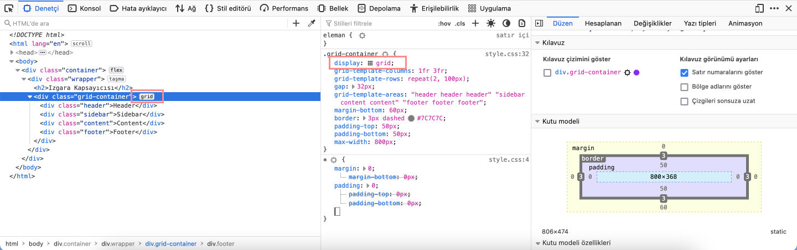

Bu görselleştirme özelliğini aktif ettiğimizde,

- Izgara satırlarını ve sütunlarını tanımlayan çizgileri,
- Izgara izleri arasındaki boşluğu,
- Satır ve sütun numaralarını,
- Izgara çizgisi adlarını ve ızgara alan adlarını görebiliriz.

### Düzen Paneli

Düzen paneli, bir sayfaya ızgaralar eklendiğinde, bu ızgaraları görüntülemek ve bazı düzenlemeler yapmak için çeşitli ayar seçenekleri içeren bir bölüm sunar. Bu bölümden;

- Satır ve sütun numaraları aktif hale getirebilme,
- Satır isimlerini gösterip, gizleyebilme,
- Kılavuz çizgilerini genişletebilme,
- Izgaranızın mini görünümünü görüntüleme, gibi bazı düzenlemeleri yapabiliriz.

<figure >
  <video controls="true" allowfullscreen="true">
    <source src="https://user-images.githubusercontent.com/47773417/154422142-a66d2fb2-2c3d-4ddb-a07d-0f26ce7e024b.mp4" type="video/mp4">
  </video>
</figure>

## Tarayıcı Desteği <a name="grid-support"></a>

Mart 2017’ye kadar ızgara düzeni için tarayıcı desteği bulunmuyordu. Sadece Internet Explorer ve Microsoft Edge desteğe sahip tek tarayıcılardı. Ancak o zaman bile `-ms-` ön eki ile birlikte kullanılabiliyordu.

Ancak Mart 2017’de, CSS Grid, büyük tarayıcıların neredeyse hepsini desteklere duruma geldi ve kullanıma sunuldu. Bugün itibariyle %95’lik bir tarayıcı desteği var.

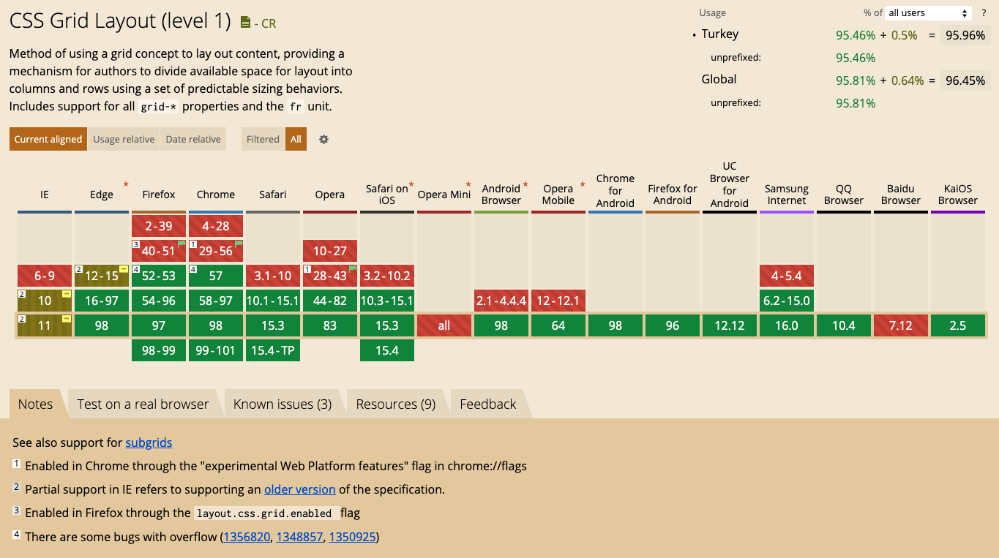

Katkılarından dolayı <a href="https://twitter.com/fatihhayri" target="_blank">Fatih Hayrioğlu</a>’na çok teşekkür ederim.

#### Kaynaklar

- [https://fatihhayrioglu.com/css-grid-giris/](https://fatihhayrioglu.com/css-grid-giris/)
- [https://developer.mozilla.org/en-US/docs/Web/CSS/CSS_Grid_Layout](https://developer.mozilla.org/en-US/docs/Web/CSS/CSS_Grid_Layout)
- [https://gridbyexample.com/](https://gridbyexample.com/)
- [https://tympanus.net/codrops/css_reference/grid/](https://tympanus.net/codrops/css_reference/grid)
- [https://www.quackit.com/css/grid/tutorial/](https://www.quackit.com/css/grid/tutorial/)
- [https://css-tricks.com/snippets/css/complete-guide-grid](https://css-tricks.com/snippets/css/complete-guide-grid)
- [https://www.codeinwp.com/blog/css-grid-tutorial-layout](https://www.codeinwp.com/blog/css-grid-tutorial-layout)
- [https://ishadeed.com/article/css-grid-minmax/](https://ishadeed.com/article/css-grid-minmax/)
