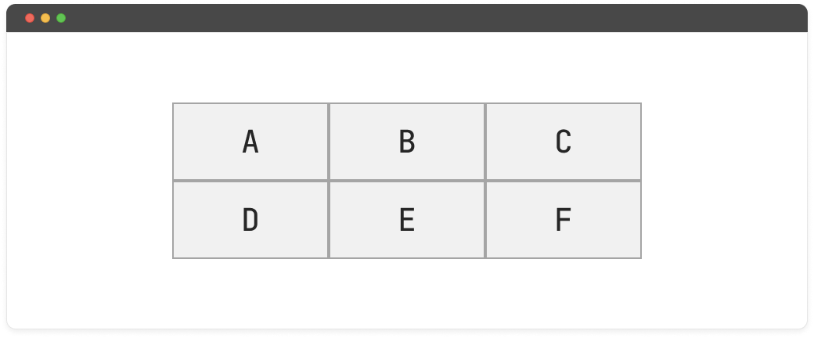
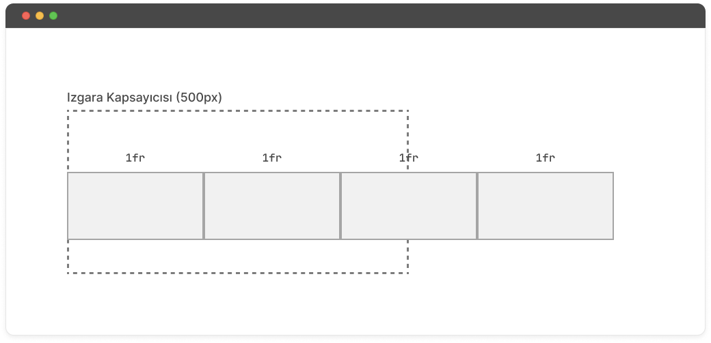

### Table of contents

- [What is Grid Layout?](#what-is-grid)
- [Grid Layout Terms](#grid-terms)
- [Grid Container: Defining the Grid Structure](#grid-container)

  - [Grid definition](#grid-definition)
  - [Defining row and column sizes](#line-column-definition)
  - [Defining row and column sizes with the fr unit](#fr-definition)
    - [Repeating rows and columns](#repeat)
    - [The minmax() function](#minmax)
  - [Spacing grid items](#grid-gap)
  - [Explicit and Implicit Grid](#grid-explicit-implicit)

- [Grid Items: Placing Items on the Grid](#grid-items)
  - [Using named grid lines](#grid-lines)
  - [Using named grid areas](#grid-line-named)
- [Grid Alignment: Aligning the Grid and Grid Items](#grid-alignment)
  - [Row and column axes](#row-column-axis)
  - [Grid alignment properties](#align-feature)
  - [Ordering grid items](#grid-order)
- [Grid Inspector Tool](#grid-inspector)
- [Browser Support](#grid-support)

When creating page layouts for web pages in the past, CSS features like table and float were commonly used. However, these features were temporary solutions for creating page layouts as neither table nor float were designed for this purpose. As web pages became more complex, there arose a need for more advanced and convenient methods to create page layouts.

Additionally, the widespread use of mobile phones led to the emergence of responsive websites. With the increasing demand for responsive sites, the complexity of layout design also grew. This complexity prompted the development of a set of features to facilitate the creation of responsive websites.

Subsequently, the Flexbox feature was introduced as a one-dimensional layout tool used to place items into rows or columns. Flexbox was designed to solve many issues related to positioning elements. It represented a significant advancement because it simplified tasks that were challenging and costly with previous layout methods.

The next step in layout design was to use a CSS-based grid system. Microsoft employees, seeking a more advanced layout system for their browsers, initially worked on a grid layout for Internet Explorer 10. After its implementation in Microsoft's browser, several web developers began experimenting with this feature. The positive results from these experiments encouraged the W3C to work on and release it as a feature. Following these efforts, browser support for CSS Grid was rolled out in all supported versions of Chrome, Firefox, Safari, and Opera in 2017.

## What is Grid Layout? <a name="what-is-grid"></a>

CSS Grid layout is a CSS layout method designed for the two-dimensional arrangement of elements on a web page or application.

Its primary purpose is to transform an HTML element into a two-dimensional grid by dividing it into rows and columns. In contrast to layouts created in HTML, such as using tables, CSS Grid allows us to create this layout in CSS. The significant advantage of layouts created in CSS is their adaptability to different contexts through the use of media queries. Additionally, CSS Grid provides a wealth of features and flexibility for positioning and organizing the elements it encompasses.

## Grid Layout Terms <a name="grid-terms"></a>

Before delving into how the features and elements of the grid layout work, there are certain grid terms associated with the grid layout. These terms make it easier for us to understand how our grid layout operates and the specifics of the grid layout we are working with.

#### Grid Container

It is the container that wraps the grid items. The scope defined by display: grid organizes the enclosed items into a grid item layout.


#### Grid Item

They are the direct child elements of the grid container.


#### Grid Lines

They are the horizontal and vertical lines that form the grid. When creating a grid layout, the grid provides numbered lines to facilitate the positioning of elements within it. Column lines are numbered from left to right, and row lines are numbered from top to bottom, starting from 1.


In a grid layout, there are as many grid lines as there are rows or columns, plus 1. For example, in a grid layout with four rows and three columns, there would be five row lines and four column lines.

#### Grid Track

It is the space between two grid lines, either horizontally or vertically. In the visual below, the grid track is the area between the second and third row lines.


#### Grid Area

A grid area is a rectangular area on the grid formed by one or more grid cells, covering a specific space on the grid.


#### Grid Cell

Grid cell is the space between four intersecting grid lines. It is the smallest unit within the grid.


After learning about grid terms, let's now explore grid layout properties. Grid layout properties are divided into two groups: those applied to the grid container and those applied to the grid items.

## Grid Container: Defining the Grid Structure <a name="grid-container"></a>

The structure of a grid container is controlled by properties applied to the grid container, such as the number of rows and columns, as well as their sizes.

### Grid Definition <a name="grid-defination"></a>

To create a grid layout, we define the `display: grid` property on our container element. This declaration turns the container element, which is the grid container, and its direct children into grid items.

```html
<div class="grid-container">
  <div class="grid-item">A</div>
  <div class="grid-item">B</div>
  <div class="grid-item">C</div>
  <div class="grid-item">D</div>
  <div class="grid-item">E</div>
  <div class="grid-item">F</div>
</div>
```

```css
.grid-container {
  display: grid;
}
```


After applying the grid definition to our container element, there won't be any visible changes in the interface because the `display: grid` definition alone doesn't divide the grid into rows and columns. We need to specify the number of rows and columns for our grid layout on the container element.

### Defining Row and Column Sizes <a name="line-column-defination"></a>

The `grid-template-rows` and `grid-template-columns` properties allow us to define rows and columns for the grid layout. There are several methods to define rows and columns. One crucial point here is knowing what we want to achieve before creating the grid structure. This determines the approach and method we will use to create our grid layout.

```css
.grid-container {
  display: grid;
  grid-template-columns: 200px 200px 200px;
  grid-template-rows: 100px 100px;
}
```



Above, we defined a grid layout with three columns each having a width of `200px` and two rows each having a height of `100px`.

#### grid-template Property

In the above grid layout, we used two separate properties to define the number of columns and rows. The `grid-template` property allows us to write these two specifications in a single line.

```css
/* grid-template: [row values] / [column values] */

.grid-container {
  display: grid;
  grid-template: 100px 100px / 200px 200px 200px;
}
```

That usage simplifies the code for grid layouts, but it also makes it harder to read.

### Defining Row and Column Sizes with the 'fr' Unit <a name="fr-defination"></a>

Grid tracks can be defined using any length unit. Alongside these units, grid layout introduces a new measurement unit called `fr`, an abbreviation for "fraction." In short, the `fr` unit represents a fraction of the available space in the grid container.

Further reading: https://hackernoon.com/understanding-css-grids-fractional-units-fr-the-easy-way-5f43ee008f29

Now, let's illustrate this feature with an example.

Let's define a grid structure with four columns, where each item has a width of `%25`. Here is the CSS code:

```css
.grid-container {
  display: grid;
  grid-template: 100px 100px / 200px 200px 200px;
}
```


Each of the grid tracks covers a `25%` portion of the grid container. Later, we can use the `grid-gap` property (which we will explore later) to add spacing between the rows within the grid container.

```css
.grid-container {
  display: grid;
  grid-template-columns: 25% 25% 25% 25%;
  grid-gap: 32px;
}
```


Even though the grid container still has the same width, the grid items overflow outside the container due to the inclusion of row and column gaps in the layout areas.

Here, the `fr` unit automatically calculates the available space, excluding the gaps, and facilitates the placement of grid items within the layout.

```css
.grid-container {
  display: grid;
  grid-template-columns: 1fr 1fr 1fr 1fr;
  grid-gap: 32px;
}
```


#### Repeating Rows and Columns <a name="repeat"></a>

Some grid layouts, when defining row or column values, may include repetitive values as shown in the previous example. Instead of specifying these values individually, we can use another feature that comes with grid layout, the `repeat()` function. The purpose of the `repeat()` function is to allow us to write repetitive values in a shorter form.

The `repeat()` function takes two values:

- The first value indicates the number of times the grid tracks will be repeated.
- The second value specifies the size of the repeated grid tracks.

```css
.grid-container {
  display: grid;
  grid-template-columns: repeat(4, 1fr);
}
```

#### Minmax() Function <a name="minmax"></a>

The `minmax()` function allows us to define a size range for grid tracks. The first value represents the minimum size, and the second value represents the maximum size.

```css
.grid-container {
  display: grid;
  grid-template-columns: minmax(200px, 500px) 1fr;
}
```

In our two-column grid structure, we defined the first column to have a width ranging from at least `200px` to a maximum of `500px`. With this definition, the first column will have a width between `200px` and `500px`, and the second column will fill the remaining space.


#### Usage Rules:

When using the `minmax()` function, there are some rules to keep in mind:

- If the minimum value is greater than the maximum value, the maximum value is ignored, and only the minimum value is applied.
- The `fr` unit is not used for the minimum value; it can only be used for the maximum value.

#### Combining with Repeat() Function

We can specify minimum and maximum value ranges for repetitive values in a grid layout. We achieve this by using `minmax` within the `repeat` function.

```css
.grid-container {
  display: grid;
  grid-template-columns: repeat(4, minmax(200px, 1fr));
}
```


In the above example, the grid layout using the minmax function within the repeat function, while functional, is not the recommended approach. When defining rows or columns with the repeat function in a grid layout, we typically specify a fixed value. When we add a value assignment to our grid tracks using minmax alongside, if the width of the grid container is narrower than the minimum width of the grid cells, the grid tracks overflow outside the container and do not wrap into new rows. This is because of the fixed value assigned to the repeat function.



To prevent this issue, we can create a responsive grid layout without the need for additional media queries by using the `auto-fit` or `auto-fill` values, which are another feature that comes with the grid layout.

#### auto-fit and auto-fill Values

The `auto-fit` and `auto-fill` values allow us to create as many columns or rows as can fit within the available space without overflowing outside the grid container. In cases where they do not fit within the grid container, they automatically move to the next row or column.


These two values may initially seem like opposite values, but there is a subtle difference between them. This subtle difference becomes apparent when the width of the grid container is greater than the total width of the grid tracks.

The `auto-fit` value expands the remaining space to fill the grid tracks when the total width of the grid tracks does not exceed the width of the grid container. The `auto-fill` value preserves the remaining space without changing the width of the grid tracks.

Let's look at the example below to better understand the difference.

```css
.grid-container--fit {
  display: grid;
  grid-template-columns: repeat(auto-fit, minmax(200px, 1fr));
}

.grid-container--fill {
  display: grid;
  grid-template-columns: repeat(auto-fill, minmax(200px, 1fr));
}
```


Until a certain viewport width, both values yield the same result. The difference becomes apparent when the viewport width changes.

<figure >
  <video controls="true" allowfullscreen="true">
    <source src="https://user-images.githubusercontent.com/47773417/154422024-d21613ae-708b-4dab-884f-93fe5c3e92ec.mp4" type="video/mp4">
  </video>
</figure>

### Gapping Grid Items <a name="grid-gap"></a>

The `column-gap` and `row-gap` properties are used in a grid layout to adjust the spacing between rows or columns.

```css
.grid-container {
  display: grid;
  grid-template-columns: repeat(4, 1fr);
  grid-template-rows: repeat(2, 100px);
  column-gap: 32px;
  row-gap: 32px;
}
```


We can define row and column gaps separately, or we can use the `gap` property to define both values within a single line. Additionally, assigning a single value to the `gap` property ensures that the same value is applied for both row and column gaps.

```css
/* gap: [row gap] / [column gap] */

.grid-container {
  display: grid;
  grid-template-columns: repeat(4, 1fr);
  grid-template-rows: repeat(2, 100px);
  gap: 32px;
}
```

### Explicit Grid and Implicit Grid <a name="grid-explicit-implicit"></a>

Typically, when creating a grid layout, we use the `grid-template-columns` and `grid-template-rows` properties to define a fixed number of rows and columns for the grid. Since the number of items inside this fixed grid layout is known, we refer to this type of layout as an "explicit" grid.

However, in some cases where grid items are dynamically generated, we may have grid items outside of the explicitly defined grid.

For example, when we want to create a grid layout with three columns each having a width of `200px` and two rows each having a height of `100px`, we make the definition to accommodate six grid items within this grid layout.

```html
<div class="grid-container">
  <div class="grid-item">A</div>
  <div class="grid-item">B</div>
  <div class="grid-item">C</div>
  <div class="grid-item">D</div>
  <div class="grid-item">E</div>
  <div class="grid-item">F</div>
</div>
```

```css
.grid-container {
  display: grid;
  grid-template-columns: repeat(3, 200px);
  grid-template-rows: repeat(2, 100px);
  gap: 32px;
}
```


If we later add three more grid items to this grid layout, we will now have three grid items outside of our originally defined fixed grid layout. The structure that contains these items outside of the explicitly defined grid is referred to as the implicit grid.


When there are items outside of the explicitly defined grid (explicit grid items), the implicit grid is automatically created by the container, and these items are automatically sized by default. Within the grid layout, they expand based on their content or fill the remaining space in the container.

For example, in a grid container with a height of `600px`, the height of implicit grid items would be `400px`.


#### Sizing Implicit Grid Items

We observed that later added implicit grid items do not have the same height as the other items. How can we make these grid items have the same height as the others? This is where the `grid-auto-rows` and `grid-auto-columns` properties come into play. These properties allow us to set the row and column sizes for items outside of the explicitly defined grid.

```css
.grid-container {
  display: grid;
  grid-template-columns: repeat(3, 200px);
  grid-template-rows: repeat(2, 100px);
  grid-auto-rows: 100px;
  gap: 32px;
}
```


#### grid-auto-flow

In the example above, we defined the row height for our implicit grid items. But what if we wanted to define column sizes instead of row sizes for these items? This is where the `grid-auto-flow` property comes in. This property allows us to determine whether rows or columns will be used for automatically placed grid items. It takes three values: `row`, `column`, and `dense`. The default value is row, which explains why rows were created instead of columns in the example above.


If we want to use columns:

```css
.grid-container {
  display: grid;
  grid-template-columns: repeat(3, 200px);
  grid-template-rows: repeat(2, 100px);
  grid-auto-flow: column;
  grid-auto-columns: 200px;
  gap: 32px;
}
```


This definition will ensure that our implicit grid items are placed in columns instead of rows.

#### Dense Value

The `dense` value allows you to compact grid items within the grid layout and fill in any gaps caused by inconsistent-sized grid items.


When applying the `dense` value:


Using this value may lead to a distorted visual order of items, as the order changes automatically when an item fills in the remaining grid gaps. Therefore, this value may not be suitable for every situation.

## Grid Items: Placing Items on the Grid <a name="grid-items"></a>

In the above examples, we looked at the properties of the grid container that forms the grid. We saw that these properties applied to the grid container are used to define the structure of the grid. In this section, we will examine the properties of grid items to understand how we can position items within the grid layout.

Before diving into these properties, it's essential to understand the grid lines that emerge when we create a grid layout. The grid lines we mention briefly in grid terms are numbered lines created by the grid container to facilitate the positioning of grid items. These lines assist us in placing our grid items.

There are multiple methods for placing grid items within a grid layout. Let's explore these methods one by one.

Firstly, to place a grid item on the grid, we can specify the starting and ending grid lines by using the grid item properties below.

- grid-column-start
- grid-column-end
- grid-row-start
- grid-row-end

```html
<div class="grid-container">
  <div class="header">Header</div>
  <div class="sidebar">Sidebar</div>
  <div class="content">Content</div>
  <div class="footer">Footer</div>
</div>
```

```css
.grid-container {
  display: grid;
  grid-template-columns: 1fr 3fr;
  grid-template-rows: repeat(2, 100px);
  gap: 32px;
}

.header {
  grid-row-start: 1;
  grid-row-end: 2;
  grid-column-start: 1;
  grid-column-end: 4;
}

.sidebar {
  grid-row-start: 2;
  grid-row-end: 3;
  grid-column-start: 1;
  grid-column-end: 2;
}

.content {
  grid-row-start: 2;
  grid-row-end: 3;
  grid-column-start: 2;
  grid-column-end: 4;
}

.footer {
  grid-row-start: 3;
  grid-row-end: 4;
  grid-column-start: 1;
  grid-column-end: 4;
}
```

This code block positions the items within the grid layout based on the row line numbers.


We can further simplify the above definition using the `grid-column` and `grid-row` properties.

```css
.header {
  grid-row: 1 / 2;
  grid-column: 1 / 4;
}
```

Additionally, thanks to the `grid-area` property, we can write these four values in a single line.

```css
/* grid-area: grid-row-start / grid-column-start / grid-row-end / grid-column-end */

.header {
  grid-area: 1 / 1 / 2 / 4;
}
```

### Using Named Grid Lines <a name="grid-lines"></a>

Above, we positioned grid items by specifying start and end line numbers. This approach can become challenging to understand in more complex grid layouts. Therefore, naming grid lines and then placing grid items using these named lines provides a clearer structure for grid layouts.

Within the grid layout, we can name the rows and columns defined by the `grid-template-rows` and `grid-template-columns` properties. When naming these grid lines, we enclose the names in square brackets `[]`. While we can choose any names we like, it's beneficial to provide meaningful names for a clear and readable grid layout.

Let's recreate the above example by naming the grid lines.

Here, we can assign multiple names to a single line. This implies that each line has two different names based on its position within the grid. We specify the two different names within a single pair of square brackets.

```css
.grid-container {
  display: grid;
  grid-template-rows: [header-row-start] 100px [header-row-end sidebar-row-start] 100px [sidebar-row-end footer-row-start] 100px [footer-row-end];
  grid-template-columns: [header-col-start] 1fr [sidebar-col-end content-col-start] 3fr [header-col-end];
  grid-gap: 32px;
}
```

Let's place the grid line names we created on the grid items.

```css
.header {
  grid-row: header-row-start / header-row-end;
  grid-column: header-col-start / header-col-end;
}

.sidebar {
  grid-row: sidebar-row-start / sidebar-row-end;
  grid-column: header-col-start / sidebar-col-end;
}

.content {
  grid-row: sidebar-row-start / sidebar-row-end;
  grid-column: content-col-start / header-col-end;
}

.footer {
  grid-row: footer-row-start / footer-row-end;
  grid-column: header-col-start / header-col-end;
}
```


### Using Named Grid Areas <a name="grid-line-named"></a>

Another way to position grid items on the grid is by naming grid areas using the `grid-template-areas` property.

After creating custom area names for our grid items with the `grid-area` property, we specify these custom area names in our grid container using the `grid-template-areas` property.

```html
<div class="grid-container">
  <div class="header">Header</div>
  <div class="sidebar">Sidebar</div>
  <div class="content">Content</div>
  <div class="footer">Footer</div>
</div>
```

Here, since the positioning of items will be done with CSS, the order of the HTML elements above is not important.

Let's define custom area names for our grid items.

```css
.header {
  grid-area: header;
}

.sidebar {
  grid-area: sidebar;
}

.content {
  grid-area: content;
}

.footer {
  grid-area: footer;
}
```

Next, let's place the named areas in the grid container.

```css
.grid-container {
  display: grid;
  grid-template-columns: 1fr 3fr;
  grid-template-rows: repeat(2, 100px);
  gap: 32px;
  grid-template-areas:
    "header header header"
    "sidebar content content"
    "footer footer footer";
}
```


In the layout above, each section within the quotes represents a row, and each word represents a column. The crucial point here is that each row must have an equal number of areas.

The following usage is incorrect and the assigned values will be considered invalid.

```css
.grid-container {
  grid-template-areas:
    "header header"
    "sidebar content content"
    "footer footer footer";
}
```

In our initial example, we created an equal number of grid areas. In some cases, we need to define empty areas for unequal sections. To define empty areas within the `grid-template-areas` property, we use a period (.) in the space where we want to specify a grid area for which we don't want to assign a name. Additionally, using a series of consecutive dots (......) instead of a single dot helps maintain vertical alignment for visual consistency in the width of the area names.

```css
.grid-container {
  grid-template-areas:
    "header header"
    "sidebar content content"
    ". footer footer";
}

/* ya da */

.grid-container {
  grid-template-areas:
    "header header"
    "sidebar content content"
    "...... footer footer";
}
```


#### Usage rules:

When using the `grid-template-areas` property, there are certain rules to keep in mind. One of them is ensuring that each row contains an equal number of areas, as mentioned earlier. Now, let's look at some other rules.

- A single grid area should not be separated by dots.

```css
.grid-container {
  grid-template-areas:
    "header header"
    "sidebar content content"
    "footer . footer";
}
```

- An area can only span either horizontally or vertically, not both.

```css
.grid-container {
  grid-template-areas:
    "side side side"
    "side content content"
    "side footer footer";
}
```

## Grid Alignment: Aligning the Grid and Grid Items <a name="grid-alignment"></a>

### Row and Column Axes <a name="row-column-axis"></a>

CSS Grid layout is a two-dimensional layout method that allows content to be placed in rows and columns. In this layout method, we have two axes: the row axis and the column axis. The flow direction of the row axis is from top to bottom, while the column axis flows from left to right.


### Grid Alignment Properties <a name="align-feature"></a>

Most of the alignment properties used in the grid layout are part of CSS's box alignment module. These properties are also used in other CSS contexts.

#### justify-items:

Grid items are aligned along the row axis.

```css
.grid-container {
  justify-items: start | end | center | stretch;
}
```


#### align-items:

Grid items are aligned along the column axis.

```css
.grid-container {
  align-items: start | end | center | stretch;
}
```


#### place-items:

The `place-items`, `justify-items`, and `align-items` properties allow us to define them in a single line.

```css
/* place-items: [align-items] / [justify-items] */

.grid-container {
  place-items: center / start;
}
```

Indeed, if the second value is not specified, a single value is used for both properties. Here's an example:

```css
/* 
justify-items: center
align-items: center
*/

.grid-container {
  place-items: center;
}
```

#### justify-content:

In some cases, the total size of grid items may be smaller than the size of the grid container. The `justify-content` property works in such situations. It treats the items inside the grid container as a single item and aligns these items accordingly.

```css
.grid-container {
  justify-content: start | end | center | stretch | space-around | space-between
    | space-evenly;
}
```


#### align-content:

The `align-content` property works on a row basis when the total height of grid items is smaller than the height of the grid container.

```css
.grid-container {
  align-content: start | end | center | stretch | space-around | space-between |
    space-evenly;
}
```


#### place-content:

The `place-content`, `align-content`, and `justify-content` properties allow defining them in a single line. The conditions that apply to the place-items property also apply to `place-content`.

The above properties were alignment properties applied to the grid container. However, some alignment properties are applied to grid items. These are:

- align-self
- justify-self
- place-self

#### justify-self:

Aligns the specified grid item along the row axis inside the grid. The only difference from the `justify-items` property is that it applies to a single item only.

```css
.grid-container {
  justify-self: start | end | center | stretch;
}
```


#### align-self:

Aligns the specified grid item along the column axis inside the grid.

```css
.grid-container {
  align-self: start | end | center | stretch;
}
```


#### place-self:

Works in the same logic as `place-items` and `place-content`. Allows us to define `justify-self` and `align-self` properties in a single line.

```css
/* place-self: [align-self] / [justify-self] */

.grid-item {
  place-self: center / start;
}
```

### Grid Item Ordering <a name="grid-order"></a>

In a grid layout, the specified `order` value allows us to determine the placement order of grid items.

```html
<div class="grid-container">
  <div class="grid-item a">A</div>
  <div class="grid-item b">B</div>
  <div class="grid-item c">C</div>
  <div class="grid-item d">D</div>
</div>
```

```css
  display: grid;
  grid-template-columns: repeat(4, 200px);
  grid-template-rows: repeat(1, 100px);
  gap: 32px;
}

.c {
	order: -1;
}
```


## Grid Inspector Tool <a name="grid-inspector"></a>

The Grid Inspector tool is a browser feature that allows us to visualize, inspect, and edit the code of our grid layout directly in the browser. It is quite useful for interpreting the grid visually, especially in complex grid layouts.

This tool was initially exclusive to the Firefox browser. Later on, other browsers also introduced similar features, though not as comprehensive as the Firefox tool. Since the features in other browsers are relatively new, I'll provide examples using the Firefox tool.

To use this tool, right-click on the page and select "Inspect Element" to open the developer tools.

### Visualizing Grids

There are two ways to visualize our grid layouts:

- Within the HTML panel, by clicking on the small grid icon next to our grid element.
- In the CSS panel, in the style section, by clicking on the grid icon next to the element where `display: grid` is defined.


When we activate this visualization feature, we can see:

- The lines defining grid rows and columns,
- The gaps between grid tracks,
- Row and column numbers,
- Grid line names and grid area names.

### Layout Panel

The layout panel provides various settings to view and make some adjustments to grids when they are added to a page. From this section, you can:

- Enable and disable row and column numbers,
- Show or hide row names,
- Expand guide lines,
- View the mini map of your grid, and more.

<figure >
  <video controls="true" allowfullscreen="true">
    <source src="https://user-images.githubusercontent.com/47773417/154422142-a66d2fb2-2c3d-4ddb-a07d-0f26ce7e024b.mp4" type="video/mp4">
  </video>
</figure>

## Browser Support <a name="grid-support"></a>

Until March 2017, there was no browser support for the grid layout. Only Internet Explorer and Microsoft Edge were the browsers that supported it, even though it required the `-ms-` prefix.

However, as of March 2017, CSS Grid became widely supported by major browsers and was officially released. As of today, it has around 95% browser support.


I would like to express my sincere thanks to <a href="https://twitter.com/fatihhayri" target="_blank">Fatih Hayrioğlu</a> for his contributions.

#### Resources:

- [https://fatihhayrioglu.com/css-grid-giris/](https://fatihhayrioglu.com/css-grid-giris/)
- [https://developer.mozilla.org/en-US/docs/Web/CSS/CSS_Grid_Layout](https://developer.mozilla.org/en-US/docs/Web/CSS/CSS_Grid_Layout)
- [https://gridbyexample.com/](https://gridbyexample.com/)
- [https://tympanus.net/codrops/css_reference/grid/](https://tympanus.net/codrops/css_reference/grid)
- [https://www.quackit.com/css/grid/tutorial/](https://www.quackit.com/css/grid/tutorial/)
- [https://css-tricks.com/snippets/css/complete-guide-grid](https://css-tricks.com/snippets/css/complete-guide-grid)
- [https://www.codeinwp.com/blog/css-grid-tutorial-layout](https://www.codeinwp.com/blog/css-grid-tutorial-layout)
- [https://ishadeed.com/article/css-grid-minmax/](https://ishadeed.com/article/css-grid-minmax/)
