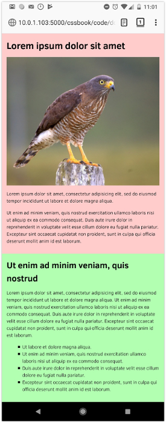
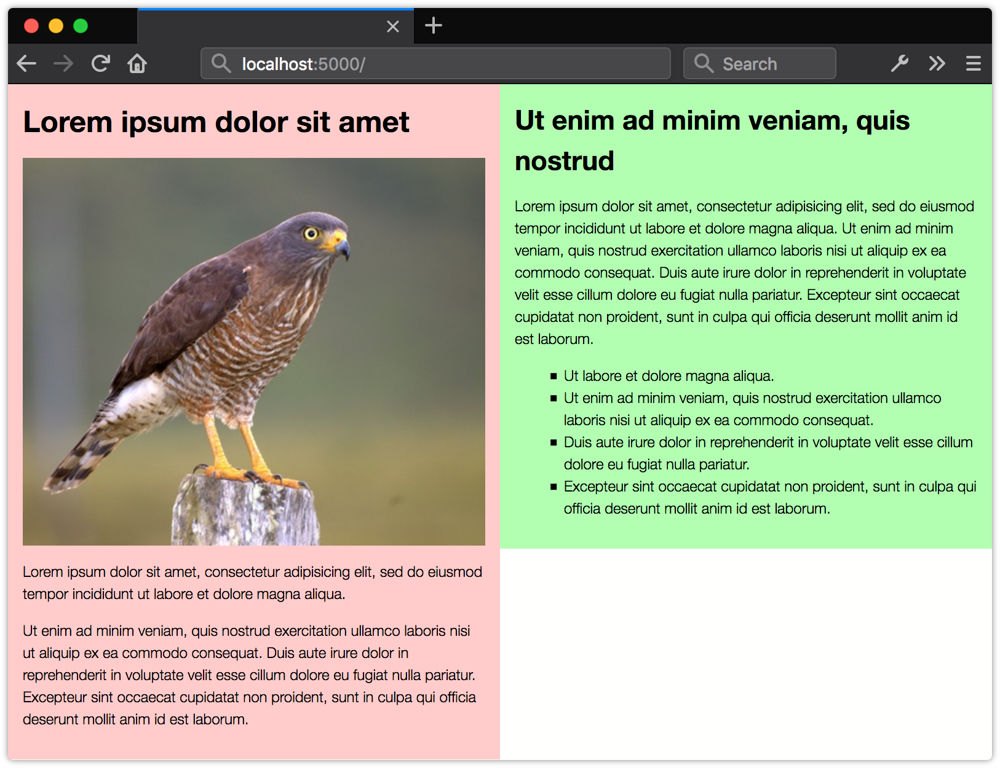

CSS’te bazı durumlarda, bir koşula bağlı olarak stil yazma ihtiyacımız olabilir. Bu gibi durumlarda devreye koşullu CSS girer. Koşullu CSS, bir koşul karşılığında uygulanan CSS kurallarını ifade eder.

Son yıllarda özellikle mobil cihazların çeşitliğinin ve kullanımının artmasıyla birlikte, her cihaza uygun web siteleri yapmak bir zorunluluk haline geldi. Bu noktada devreye en sık kullanılan koşul ifadesi medya sorguları girer. Medya sorguları farklı cihazlar ve çözünürlükler için stil tanımlamaları yapmamıza olanak sağlayan bir CSS özelliğidir.


## Medya Sorguları ve media
@media kuralı, pencere ve görünüm alanı genişliği, ekran yönü ve çözünürlüğü gibi özellikleri temel alarak, geliştiricilerin farklı ortam türlerine göre stiller tanımlamalarını sağlar.

@media kuralı aslında CSS’in uzun süredir devam eden bir özelliğidir. HTML4 ile birlikte, geliştiricilerin farklı ortam türlerine, farklı stiller tanımlayabilmesini sağladı. Ancak HTML4 tarafından tanımlanan ortam türlerinin çoğu artık kullanılmıyor. Kullanılan ortam türlerinden ise yalnızca bazıları, bütün tarayıcıları desteklemektedir.


## Medya Sorgusu Tanımlama
Medya sorguları en basit haliyle, tek başına veya bir ortam koşuluyla birlikte kullanılan bir ortam türünden oluşur. CSS stilleri ise bu @media kümesinin içine tanımlanır. Tarayıcı veya cihaz sorgudaki herhangi bir koşulu karşılaması durumunda @media kümesinin içine yazılan stiller uygulanmış olur.

```css
/* Koşul içermeyen medya sorgusu */
@media {
  /* Stil Alanı */
}


/* Sadece ekranlar üzerinde çalışan bir medya sorgusu */
@media screen {
  /* Stil Alanı */
}
```

Medya türleri tek başlarına kullanıldığı gibi, aynı sorguya ait birden fazla medya türünü de ekleyebiliriz. Her medya türünü virgülle ayırarak bir veya daha fazla medya türüne CSS stilleri uygulayabiliriz. Örneğin aşağıdaki kod bloğundaki stiller ekranlar ve yazıcılar için tanımlanmıştır:

```css
@media screen, print {
  body {
    font-size: 20px;
  }
}
```

**NOT:** Medya sorgularında, ortam türleri isteğe bağlıdır, bir ortam türü belirtilmediğinde varsayılan olarak tüm medya türlerini temel alır, yani CSS stilleri, tüm medya türlerine, koşulları karşıladığı sürece uygulanır.

Medya sorgularının en güçlü yanı, bir ortam özelliği sorgusu eklediğimizde ortaya çıkar. Ortam özelliği sorguları, aygıtın özelliklerini veya görünüm penceresinin koşullarını sorgular.

Bir medya özelliği sorgusu, iki nokta üst üste ile ayrılmış bir özellik ve değerden oluşur. Sorgu ayrıca parantez içinde yazılmalıdır.

```css
@media (width: 576px) {
  nav li {
    color: #FC5000;
  }
}
```

Yukarıdaki örnekte, cihazın ekran genişliği 576 piksel’e eşit olduğunda `li` etiketinin rengi değişir.

Ancak bu sorgunun bazı sorunları var. Yukarıdaki kod bloğunda, ekran genişliği 576 piksel’den dar veya geniş olduğunda herhangi bir stil uygulanmayacaktır, sadece 576 piksel’e eşit olduğu durumda stiller uygulanacaktır. Bu şekilde kullanmak yerine medya sorgularının desteklediği `min-` ve `max-` öneklerini kullanıyoruz.


## Aralıklı Medya Özelliği Sorguları
Daha esnek medya sorguları, ekran genişliğinin minimum ve maksimum değerlerini kontrol etmemize olanak tanır. Ekran genişliği en az bu kadar geniş veya en fazla bu kadar geniş olduğunda stilleri uygula gibi tanımlamalar yapabiliriz. `min-` ve `max-` önekleri, bir özellik aralığının alt veya üst sınırlarını belirler.

```css
@media (max-width: 576px) {
  nav li {
    color: #FC5000;
  }
}
```

Yukarıdaki kod bloğunda, ekran genişliği en fazla 576 piksel olana kadar içindeki stilleri uygula demektir. Ekran genişliği 576 piksel’den geniş olduğu durumda artık tanımladığımız CSS stilleri geçersiz kalır.

Ortam sorgularında, `min-` ve `max-` öneklerinin yanında `and` anahtar sözcüğünü de birlikte kullanabiliyoruz. And iki veya daha fazla medya özelliğini birbirine bağlar. Örneğin ekran genişliği en az 576 piksel, en fazla 992 piksel arasında bir CSS stili uygulamak isteseydik;

```css
@media (min-width:576px) and (max-width: 992px) {
  nav li {
    color: #FC5000;
  }
}
```
şeklinde tanımlama yapmamız gerekirdi. Yukarıdaki kod bloğunda stilimiz, her iki koşulu karşıladığı durumda çalışacaktır.

Gelecekte tarayıcılar, aralıklar için `min-` ve `max-` öneklerine ek olarak `<` ve `≥=` gibi karşılaştırma operatörlerini destekleyebilir. Böylelikle yukarıda yazdığımız kodu aşağıdaki şekilde yazabiliyor olacağız.

```css
@media (width >= 576px) and (width <= 992px) {
  nav li {
    color: #FC5000;
  }
}
```

Bu tanımlamanın aslında ilk yazdığımız tanımlamadan hiçbir farkı yoktur. Hatta bu tanımlama `min-` ve `max-` önekleri kullanmaktan daha basittir. Ama bu sözdizimi, henüz çoğu tarayıcı tarafından desteklenmemektedir, o yüzden şimdilik `min-` ve `max-` ile yola devam.


## Negatif Medya Sorguları
Medya sorgularında, `and` gibi yardımcı anahtar sözcükleri kullanabiliyorduk. Bu yardımcı anahtar sözcüklerden bir tanesi de `not`. Not, bir medya sorgusunu olumsuz hale getirir. Bu anahtar sözcüğü tanımlanırken, ortam türü veya özelliğinden önce tanımlanır.

```css
@media not print {
  body {
    font-size: 16px;
  }
}
```

## İçeriğe Dayalı Medya Sorguları
Medya sorgularını kullanırken, şu anda yaygın olarak kullanılan bir yöntem, popüler cihaz boyutlarına göre minimum genişlik ve maksimum genişlik breakpointleri belirlemektir. Breakpoint, bir ortam sorgusunu ve bunun sonucunda ortaya çıkan düzen değişikliklerini tetikleyen kırılma noktalarıdır.

```css
@media screen and (max-width: 320px) {
  /* Stil Alanı */
}

@media screen (min-width: 320px) and (max-width: 480px) {
  /* Stil Alanı */
}

@media screen (min-width: 481px) and (max-width: 768px) {
  /* Stil Alanı */
}

@media screen (min-width: 769px) {
  /* Stil Alanı */
}
```

Responsive tasarımın ilk zamanlarında, birçok tasarımcı özel ekran boyutlarını hedeflemeye çalıştı. Bu yapı çok sayıda kullanıcı için sorunsuz çalışıyordu ancak çok çeşitli boyutlara sahip çok fazla cihaz ortaya çıktı. Bu, tüm tasarımcılar için belirli boyutları hedeflemek yerine, tasarımı, içeriğin bir şekilde kırılmaya başladığı boyutta değiştirmenin daha iyi bir yaklaşım olduğunu ortaya çıkardı.

#### Medya Sorgularını ekran genişlikleri ile kullanmayın
Medya sorguları için cihaz genişliği kullanmaktan kaçının. Özellikle yüksek DPI’lı cihazlar, gerçek piksel özelliğine uymayan bir cihaz genişliğine sahip olabilir.

Medya sorgularında içerik merkezli bir yaklaşım, düzenin zayıf yönlerinin ortaya çıktığı noktalara göre breakpointler belirler.

Ortam sorgularını eklemeden önce esnek bir düzen oluşturulabilir. Ardından ekran genişliğini artırdıkça, ek alanlardan yararlanan stiller kullanabiliriz. Örneğin metin satırları okunamayacak kadar uzun olduğunda tarayıcı penceresi ne kadar geniştir? Bu düzeninizin tek sütunlu bir düzenden iki sütunlu bir düzene geçtiği nokta olabilir. İşte bu noktayı artık bir breakpoint olarak belirleyebiliriz.

Aşağıdaki Örneği inceleyelim;

Mobil Görünüm:



Masaüstü Görünüm:




## Görüntü Alanı Meta Etiketi
```html
<meta name=”viewport” content=”width=device-width,initial-scale=1">
```

Bu, görüntü alanı meta etiketidir. Mobil tarayıcıların içeriği nasıl oluşturduğunu kontrol etmenin bir yoludur. Varsayılan olarak, çoğu mobil tarayıcı görüntü alanı genişlikleri hakkında yalan söylediğinden bu tanım gereklidir. Duyarlı olmayan siteler, dar bir görüntü alanında oluşturduklarında genellikle kötü görünürler, bu nedenle mobil tarayıcılar, siteyi varsayılan olarak gerçek cihaz genişliğinden (genelikle 960px) daha geniş bir görüntü alanı genişliğiyle oluşturur ve ardından oluşturulan sonucu sığacak şekilde küçültür ve ekrana basar. Bu durumda responsive tasarım için yazmış olduğumuz medya sorguları (örneğin @media screen (max-width: 576px) { …….} ) çalışmayacaktır.

Bu sorunu düzeltmek için yukarıdaki gibi bir görüntü alanı meta etiketi, tarayıcıya “içeriği 960 piksel görüntü alanıyla oluşturma, bunun yerine gerçek cihaz genişliğini kullanarak oluştur ve varsayılan olarak bir başlangıç ölçek düzeyi ayarla” der. Bu tanımı yaptıktan sonra artık medya sorguları devreye girmiş olur.


### Özetle;
Medya sorguları ile, çeşitli cihazlar ve alanlar için esnek düzenler oluşturabilir, ve bu cihazlara uygun stil özellikleri tanımlayabilirsiniz.

<br>
<br>

#### Kaynaklar;

* https://fatihhayrioglu.com/css-3-medya-sorgulari/
* https://www.sitepoint.com/premium/books/css-master-2nd-edition/read/8
* https://developer.mozilla.org/en-US/docs/Learn/CSS/CSS_layout/Media_queries
* https://css-tricks.com/css-media-queries/
